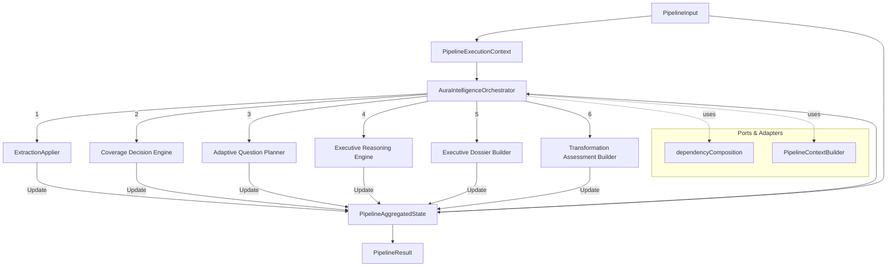

# Aura Intelligence OS Architecture Review (AI-02R)

## 1. Executive Summary
This document presents an independent, passive architectural audit of the Aura Intelligence OS (phases AI-02A, AI-02B, and AI-02C). The OS orchestrates domain logic from enterprise models in a deterministic, sequential pipeline. The audit validates that the architecture is largely coherent, decoupled, and safe for early integration in Shadow Mode, provided certain conditions are met. Overall decision: **GO WITH CONDITIONS**.

## 2. Scope
- Branch: `audit/intelligence-os-architecture-review`
- Modules audited: `src/modules/intelligence/os/*`
- Associated engines: `src/modules/intelligence/enterprise-model/*`
- Constraints: Passive audit only, no code modifications, no external integrations.

## 3. Verified Repository State
- **Node**: v20 / v22 (per `package.json` engines)
- **Vitest**: v4.1.10
- **OS Tests**: PASS (25/25)
- **Enterprise Model Tests**: PASS (200/200)
- **Build (`npm run build`)**: PASS
- **TypeScript (`tsc -b`)**: PASS
- **Git Status**: Clean worktree, PR #20 correctly merged in `origin/main`.

## 4. OS Inventory
| File | Responsibility | Classification | Notes |
|------|----------------|----------------|-------|
| `types.ts` | Public contracts, statuses, execution IDs. | Contract | Clean separation, stable `PipelineResult`. |
| `ports.ts` | Infrastructure boundaries (Clock, IdGen, Audit, Timeout). | Port | Clean interfaces, no concrete implementations. |
| `errors.ts` | OS-level error types and code definitions. | Error | Handles normalization, but strips inner stack trace. |
| `contextTypes.ts` | State aggregation (`PipelineAggregatedState`). | State | Holds all inputs and outputs. Mutability risk present. |
| `PipelineExecutionContext.ts` | Immutable context container for execution start. | State | Deep freezes initial input. |
| `dependencyComposition.ts` | Structural definitions of external engines. | Port | Ensures orchestrator remains decoupled from concrete classes. |
| `PipelineContextBuilder.ts` | Constructs contexts for specific engines. | Builder | Checks dependencies, throws OS errors. No domain logic. |
| `AuraIntelligenceOrchestrator.ts` | Sequential execution coordinator. | Facade | Orchestrates engines, catches errors, generates audit trail. |
| `tests/*` | Vitest suites and mocks. | Test | High coverage of orchestration paths. |

## 5. Architecture Map

## 6. Execution Matrix
| Order | StageId | Engine | Input Required | Output | Continue on failure? |
|-------|---------|--------|----------------|--------|----------------------|
| 1 | `EVIDENCE_EXTRACTION` | `ExtractionApplier` | `mentalModel`, `knowledgeGraph`, `extractionResult` | Updated MM, KG, Extraction | **NO** (skips all) |
| 2 | `KNOWLEDGE_COVERAGE` | `CoverageDecisionEngine` | `knowledgeGraph` | `coverageReport`, `readiness` | **YES** |
| 3 | `ADAPTIVE_PLANNING` | `AdaptiveQuestionPlanner` | `knowledgeGraph`, policies | `planningResult` | **YES** |
| 4 | `EXECUTIVE_REASONING` | `ExecutiveReasoningEngine` | `mentalModel`, `knowledgeGraph`, `coverageReport` | `reasoningReport` | **NO** (skips 5, 6) |
| 5 | `EXECUTIVE_DOSSIER` | `ExecutiveDossierBuilder` | `reasoningReport`, policies | `dossier` | **NO** (skips 6) |
| 6 | `TRANSFORMATION_ASSESSMENT` | `AssessmentBuilder` | `dossier`, `reasoningReport` | `assessment` | **NO** |

*Note: Extraction runs exactly once per pipeline invocation. Reasoning is a hard dependency for Dossier and Assessment.*

## 7. Responsibility Review
- **types.ts**: Clean and focused. Mixing of `StageStatus` and `PipelineStatus` is well-bounded.
- **ports.ts**: Ports are minimal and appropriately segregated. `PipelineTimeoutPolicy` and `PipelineCancellationSignal` exist conceptually.
- **PipelineExecutionContext**: Correctly isolated. Handles deep freezing of inputs well.
- **contextTypes.ts**: `PipelineAggregatedState` is large but necessary for a single-pass orchestration. It uses optional fields appropriately.
- **dependencyComposition.ts**: Heavy structural typing decoupling OS from exact domain classes. Good for testing, slight risk of contract drift.
- **PipelineContextBuilder**: Pure data transformations. No business decisions.
- **AuraIntelligenceOrchestrator**: True Facade. Logic is strictly control-flow. Does not bleed into domain.

## 8. Dependency Review
- **Direction**: Strict unidirectional flow. OS depends on abstract ports; Engines provide implementations.
- **Coupling**: The orchestrator is completely unaware of how models are built.
- **Observation**: `dependencyComposition.ts` redefines structural shapes of engines (e.g., `extractionApplier: { applyExtraction: ... }`). This is safe but requires strict TypeScript compliance on the consumer side.

## 9. State Machine Review
- **SUCCESS**: Only if all executed stages passed AND no stages were skipped due to failure.
- **PARTIAL_SUCCESS**: If at least one stage passed, but others failed or skipped.
- **FAILED**: If no stages succeeded, or if a critical dependency (Extraction) fails immediately.
- **CANCELLED**: Properly implemented via `cancellationSignal.aborted`.
- **TIMED_OUT**: Declared in types, but **not implemented** in the Orchestrator loop.

## 10. Error Model Review
- `AuraIntelligenceOSError` correctly captures and serializes errors.
- **Risk**: `toJSON()` strips the native stack trace from the `cause` error. While good for security/privacy, it degrades debuggability in early Shadow Mode.

## 11. Determinism and Immutability
- **Clock/IDs**: Abstracted via `PipelineClock` and `PipelineIdGenerator`. Excellent determinism.
- **Immutability**: `PipelineExecutionContext` deep-freezes `initialInput`.
- **Mutation Risk**: `PipelineAggregatedState` uses shallow cloning (`{ ...state }`). If an engine mutates the nested `knowledgeGraph` directly, side effects leak. True immutability of domain objects is enforced only by TS `readonly`, not runtime freezes.

## 12. Concurrency and Reentrancy
- The OS executes sequentially internally.
- Reentrancy is safe as long as injected engine instances are stateless.
- If run concurrently for the same session (e.g., rapid user messages), there is no OS-level locking. A future `ShadowExecutionGuard` or `SessionQueue` is required.

## 13. Performance
- Structural cloning is avoided in favor of shallow references. Memory footprint per execution is low.
- Sequential execution bounds CPU spikes but increases latency.
- Future worker threads may be needed if `CoverageCalculator` or `ReasoningEngine` scale in complexity.

## 14. Privacy and Security
- `PipelineAggregatedState` holds sensitive strategic data (Evidence, Dossier, Objectives).
- Serialized errors could leak PII if domain objects are stringified in `message`.
- **Action**: Shadow Mode must redact or hash specific `metadata` before persisting `PipelineResult` to Firebase.

## 15. Shadow Mode Readiness
- **Execution**: Can run silently without affecting the active Discovery session.
- **Outputs**: `PipelineResult` is highly structured and ready for analytical capture.
- **Missing**: A comparator to evaluate Shadow vs. Discovery answers, and a queue to prevent race conditions during rapid chat turns.

## 16. Discovery Compatibility
- **Gaps**: Discovery expects incremental streaming (SSE); OS is currently a one-shot batch process.
- **Adapters Needed**: A translation layer to map Discovery `ChatSession` into `PipelineAggregatedState`.

## 17. Future Architecture Compatibility
- Extensible enough for standalone PDF generation, Radiografía Empresarial, or batch assessments without UI.

## 18. Test Quality Review
- **Coverage**: High coverage of positive and negative paths in `AuraIntelligenceOrchestrator`.
- **Missing Tests**: No explicit tests for `TIMED_OUT` state transitions. No tests validating deep immutability under malicious engine mutation.

## 19. Findings
| ID | Severity | File | Description | Impact | Recommendation | Sprint | Condition to Close |
|---|---|---|---|---|---|---|---|
| F-01 | LOW | `AuraIntelligenceOrchestrator.ts` | `TIMED_OUT` status is declared in types but never evaluated or assigned during execution. | Inaccurate state representation if a timeout policy aborts execution. | Implement timeout checks around stage execution. | AI-02D | Orchestrator fails stage if timeout exceeded. |
| F-02 | MEDIUM | `errors.ts` (L36) | `toJSON()` drops the stack trace of `cause`. | Difficult root cause analysis in production/Shadow Mode logs. | Retain serialized stack traces in development/shadow environments. | AI-02E | Serialized error includes full stack. |
| F-03 | MEDIUM | `AuraIntelligenceOrchestrator.ts` | Shallow cloning of `PipelineAggregatedState` allows internal reference mutation. | Concurrent executions might corrupt shared in-memory state. | Enforce deep freezing or use immutable data structures for domain outputs. | AI-02D | `PipelineAggregatedState` yields immutable references. |
| F-04 | OBSERVATION | `dependencyComposition.ts` | Heavy structural typing duplicates signatures. | Refactoring domain classes won't throw TS errors immediately in OS if structures happen to align. | Rely on strict interface exports from domain if safe. | N/A | N/A |

## 20. Technical Debt Register
| Debt | Origin | Impact | Priority | Blocks Shadow Mode? | Blocks Discovery? | Closure Criterion |
|---|---|---|---|---|---|---|
| No Timeout Enforcement | AI-02C | Infinite loops in engines hang the OS. | HIGH | NO (but risky) | YES | Timeout aborts stage. |
| Shallow State Cloning | AI-02B | Mutable state leakage. | MEDIUM | NO | YES | State guarantees immutability. |
| Missing Error Stack | AI-02A | Debugging blind spots. | MEDIUM | NO | NO | Stack traces persisted securely. |

## 21. Conditions to Advance
The OS may advance to Shadow Mode integration (**GO WITH CONDITIONS**) if:
1. **ShadowExecutionGuard** is implemented to guarantee that concurrent Firebase triggers don't race the orchestrator.
2. An **Error/Audit Sink Adapter** is provided to safely log outputs without leaking sensitive PII/Strategic data.

## 22. Recommended Roadmap
1. **AI-02D — Resilience, Timeouts & Cancellation**: Implement `TIMED_OUT` handling and deep immutability guarantees.
2. **AI-02E — Shadow Contracts & Execution Guard**: Define the async queue for shadow events.
3. **AI-02F — Shadow Comparator & Capture Adapter**: Build telemetry to compare legacy vs OS.
4. **AI-02G — Productive Boundary Adapter**: Connect to Discovery (Read-only).
5. **AI-02H — Controlled Shadow Integration**: Deploy and monitor.

## 23. Final Decision
**GO WITH CONDITIONS**
