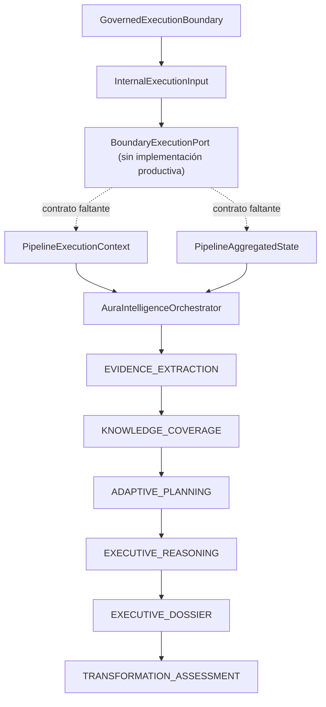
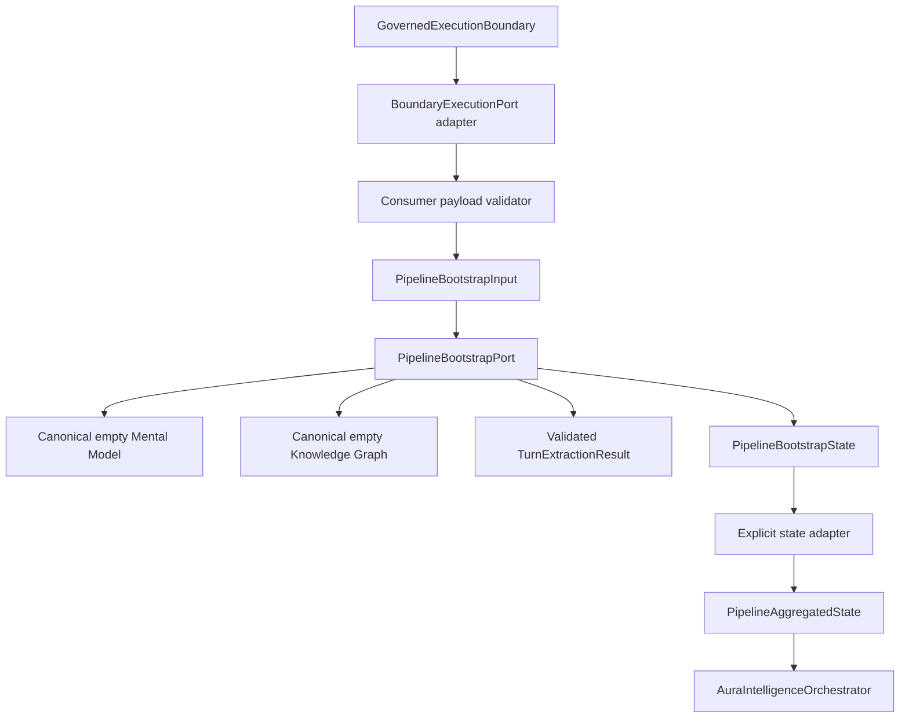

# AI-02G.2 — Pipeline Bootstrap Contract Audit

## 1. Executive Summary

Esta auditoría determina que `AuraIntelligenceOrchestrator` no recibe evidencia inicial. Recibe un `PipelineInput` de control y, opcionalmente, un `PipelineAggregatedState` que ya debe contener los objetos de dominio necesarios para comenzar la primera etapa habilitada. En particular, la etapa denominada `EVIDENCE_EXTRACTION` no extrae evidencia cruda: aplica un `TurnExtractionResult` previamente construido sobre un `EnterpriseMentalModel` y un `EnterpriseKnowledgeGraph` también preexistentes.

La base sí contiene dos factories productivas y legítimas:

- `createEmptyEnterpriseMentalModel()`;
- `createEmptyEnterpriseKnowledgeGraph()`.

Estas factories eliminan la necesidad de inventar contenedores de dominio vacíos. No resuelven, sin embargo, la clasificación semántica de hechos normalizados, la construcción de `TurnExtractionResult`, la procedencia y confianza de `EnterpriseEvidence`, el escenario objetivo ni la composición completa de dependencias del OS.

Los cinco hechos empresariales de AI-02H1 —industria, banda de empleados, modo de programación, señal de incidencia y prioridad— son datos fuente válidos para un futuro bootstrap, pero **no son todavía un contrato de evidencia canónico**. Faltan como mínimo:

1. un `targetScenario` explícito o una regla de derivación aprobada;
2. una taxonomía de hechos y mapping a evidencia;
3. reglas de procedencia, `sourceType`, fiabilidad, directitud y polaridad;
4. un productor canónico de `TurnExtractionResult`;
5. un contrato que inicialice conjuntamente Mental Model, Knowledge Graph y evidencia acumulada;
6. un composition root general del OS con adapters estructurales para Dossier y Assessment.

La arquitectura recomendada combina:

- **A. PipelineBootstrapper**, detrás de `GovernedExecutionBoundary`;
- una versión acotada de **E. estado inicial discriminado**, distinta del agregado completo;
- **B. empty domain factories** como detalle interno del bootstrap, no como solución independiente.

No se recomienda modificar el Orchestrator en el primer incremento. El bootstrap puede producir un estado inicial validado y convertirlo explícitamente al contrato existente al invocar `executePipeline()`.

**Decisión:** GO WITH CONDITIONS para **AI-02G.2A — Bootstrap Contracts**. NO-GO para implementar AI-02G.2B o reanudar AI-02H1 hasta aprobar los contratos, la taxonomía de evidencia, el escenario mínimo y las pruebas de composición.

## 2. Canonical State

La compuerta se ejecutó antes de crear este documento:

```text
git fetch origin --prune
git branch --show-current
git rev-parse HEAD
git rev-parse origin/main
git status --short --untracked-files=all
git log -3 --oneline
```

| Verificación | Resultado |
|---|---|
| Ruta | `C:\Projects\AuraControlCenter-AI-02` |
| Rama | `feature/intelligence-os-shadow-consumer-foundation` |
| HEAD | `f80bfcc92fe597eb744cde3e5254443601e8d573` |
| `origin/main` | `f80bfcc92fe597eb744cde3e5254443601e8d573` |
| Estado inicial | Limpio |
| Commit 1 | `f80bfcc Merge pull request #26 from javiercl111-jpg/feature/intelligence-os-first-shadow-consumer` |
| Commit 2 | `e22ef30 fix(intelligence-os): propagate governed boundary payload` |
| Commit 3 | `0d4090d docs(intelligence-os): audit first governed shadow consumer` |
| Resultado | Conforme; se autorizó auditoría pasiva y un único documento |

## 3. Problem Statement

AI-02G.1 ya resuelve el transporte seguro del payload:

- `InternalExecutionInput.payload` existe en `src/modules/intelligence/os/boundary/ports.ts:34-40`;
- `GovernedExecutionBoundary` entrega la copia validada en `GovernedExecutionBoundary.ts:166-169`;
- metadata permanece separada.

El contrato se interrumpe inmediatamente después:

```text
InternalExecutionInput.payload
          |
          v
BoundaryExecutionPort
          |
          X  No existe contrato bootstrap
          |
          v
PipelineAggregatedState
          |
          v
AuraIntelligenceOrchestrator
```

`PipelineInput` (`os/types.ts:86-92`) solo transporta:

- `sessionId`;
- `executionKey`;
- `targetScenario`;
- `objectiveIds`;
- metadata de ejecución.

No representa evidencia ni estado empresarial. `PipelineAggregatedState` (`os/contextTypes.ts:26-58`) contiene tanto campos de control como resultados de todas las etapas. Su opcionalidad hace posible construir `{ sessionId }`, pero eso no satisface las precondiciones de una ejecución con dependencias reales.

El problema no es transporte, serialización o permisos. Es la ausencia de un contrato explícito para transformar evidencia fuente en el estado inicial que el pipeline reconoce.

## 4. Current Execution Flow

### 4.1 Flujo observado



### 4.2 Construcción del estado

`executePipeline(input, initialState?)` está declarado en `AuraIntelligenceOrchestrator.ts:61-64`.

- Si existe `initialState`, el Orchestrator lo clona y lo usa directamente.
- Si no existe, crea únicamente un agregado con los campos de `PipelineInput` (`AuraIntelligenceOrchestrator.ts:74-80`).
- No mezcla ni valida coherencia entre `input` e `initialState`.
- No existe discriminante de etapa inicial.
- No existe selección explícita de etapa de arranque.
- La presencia previa de un resultado no omite automáticamente su etapa; la secuencia se decide por disponibilidad de dependencias.

`PipelineExecutionContext` (`PipelineExecutionContext.ts:23-45`) conserva identificadores, clock, señal de cancelación e input congelado. Tampoco construye estado empresarial.

### 4.3 Composición real

No se encontró ninguna construcción productiva de:

- `AuraIntelligenceOSDependencies`;
- `PipelineExecutionContext`;
- `AuraIntelligenceOrchestrator`.

Fuera de pruebas solo existen las declaraciones de contratos y el propio constructor. Por tanto, no hay un composition root general del OS que pueda reutilizar un consumidor.

## 5. Pipeline State Inventory

### 5.1 Inventario resumido

| Objeto | Campos requeridos / opcionales | Constructor o factory | Estado vacío | Productor esperado | Consumidor esperado | Desde cero |
|---|---|---|---|---|---|---|
| `PipelineInput` | `sessionId`; demás opcionales | Literal + `PipelineExecutionContext` | Sí, con `sessionId` | Adapter/fachada | Orchestrator y Execution Context | Sí, pero solo control |
| `PipelineAggregatedState` | Solo `sessionId` requerido; todos los estados de dominio opcionales | No existe factory | Sintácticamente sí | Bootstrap + etapas | Todas las etapas | No de forma semántica |
| `EnterpriseMentalModel` | `identity`, `strategicContext` y doce colecciones requeridas | `createEmptyEnterpriseMentalModel()` | Sí, canónico | Bootstrap/ExtractionApplier | Extraction, Reasoning | Sí |
| `EnterpriseKnowledgeGraph` | `nodes`, `relationships` requeridos | `createEmptyEnterpriseKnowledgeGraph()` | Sí, canónico | Bootstrap/ExtractionApplier | Extraction, Coverage, Planning, Reasoning | Sí |
| `TurnExtractionResult` | Seis arrays requeridos | Sin factory productiva nombrada | Sí como literal validable | `EvidenceExtractionProvider`/mapper estructurado | `ExtractionApplier` | Sí, pero falta mapping |
| `OverallCoverageReport` | timestamp, conteos, score, nivel, breakdown completo, gaps, readiness | `CoverageCalculator.calculateOverallReport()` | No aplica; se calcula | Coverage Calculator | Planning y Reasoning | Sí desde graph vacío |
| `DecisionReadinessAssessment` | ready, score, escenario, gaps, preguntas | `CoverageDecisionEngine.evaluateDecisionReadiness()` | No aplica | Coverage Decision Engine | Reasoning y Planning | Requiere escenario |
| `AdaptiveQuestionPlanResult` | plan, objetivos, estrategias, intents, candidatos, matrices | `AdaptiveQuestionPlanner` | Resultado vacío posible | Planning | Consumidores posteriores/estado | Sí desde cobertura pobre |
| `ExecutiveReasoningReport` | ID, timestamp, status y seis colecciones | `ExecutiveReasoningEngine` / fallback | Resultado fail-closed posible | Reasoning | Dossier y Assessment | Sí si existen contextos |
| `ExecutiveDossier` | diagnóstico, summary, prioridades, narrativa, audit | `ExecutiveDossierBuilder` | No; puede ser insuficiente | Dossier | Assessment | Solo desde reasoning |
| `EnterpriseTransformationAssessment` | perfil, evidencia, readiness, insight, audit, metadata | `EnterpriseTransformationAssessmentBuilder` | No; puede ser insuficiente | Assessment | Salida final | Solo desde dossier + reasoning |

### 5.2 PipelineInput

`PipelineInput` no es un contrato de bootstrap. No tiene:

- facts;
- evidence;
- provenance;
- Mental Model;
- Knowledge Graph;
- extraction result.

`targetScenario` es opcional en el tipo, pero obligatorio para `buildCoverageContext()` cuando Coverage se ejecuta (`PipelineContextBuilder.ts:17-37`).

### 5.3 PipelineAggregatedState

Campos de control:

- `sessionId`;
- `executionKey`;
- `targetScenario`;
- `objectiveIds`;
- `metadata`.

Campos potencialmente iniciales:

- `extractionResult`;
- `mentalModel`;
- `knowledgeGraph`;
- `evidence`;
- `hypotheses`;
- `constraints`;
- `executiveObjectives`.

Campos producidos durante ejecución:

- `coverageReport`;
- `readinessAssessment`;
- `planningResult`;
- `reasoningReport`;
- `dossier`;
- `assessment`.

Campos ambiguos o reutilizables:

- `questionHistory`;
- `transformationConstraints`;
- `transformationDependencies`.

La interfaz no expresa cuáles combinaciones son válidas.

### 5.4 EnterpriseMentalModel

El contrato está en `enterprise-model/domain/types.ts:146`. Todos sus contenedores superiores son requeridos.

`createEmptyEnterpriseMentalModel()` (`services/modelUpdater.ts:5`) construye una instancia completa:

- identidad nula;
- contexto estratégico vacío;
- colecciones vacías;
- cero hipótesis o evidencia inventada.

`seedModelByIndustry()` (`seeds/industrySeeder.ts:8`) es una transformación productiva canónica. Agrega dominios `CANDIDATE` con confianza `0` y establece `identity.industry`. Solo reconoce keys presentes en `INDUSTRY_SEEDS`; un valor desconocido deja el modelo intacto.

No existe un updater canónico para:

- `employeeBand`;
- `schedulingMode`;
- `incidentSignal`;
- `normalizedPriority`.

Asignarlos directamente a campos parecidos sería una decisión de mapping nueva, no una consecuencia del contrato actual.

### 5.5 EnterpriseKnowledgeGraph

El contrato está en `graph/domain/types.ts:52`. El estado vacío canónico contiene:

```text
nodes = {}
relationships = {}
```

`createEmptyEnterpriseKnowledgeGraph()` está en `graph/services/operations.ts:14`.

Las invariantes de `graph/domain/invariants.ts` exigen:

- IDs deterministas coherentes con type/label;
- extremos existentes para toda relación;
- ausencia de self-loops;
- confianza entre `0` y `1`;
- coherencia entre status y confianza;
- ausencia de nodos semánticos duplicados;
- propiedades primitivas;
- timestamps válidos.

Un graph vacío satisface esas invariantes. Crear nodos a partir de los cinco hechos exige una taxonomía de tipos, labels, propiedades y referencias que hoy no existe.

### 5.6 TurnExtractionResult y EnterpriseEvidence

`TurnExtractionResult` (`extraction/domain/types.ts:5-12`) requiere:

- `evidence`;
- `nodeProposals`;
- `relationshipProposals`;
- `corrections`;
- `contradictions`;
- `knowledgeGaps`.

Cada `EnterpriseEvidence` (`domain/evidence.ts:15-31`) requiere, entre otros:

- `evidenceId`;
- `sessionId`;
- `turnId`;
- `source`;
- `sourceType`;
- `normalizedStatement`;
- `category`;
- `entityRefs`;
- `capturedAt`;
- `reliability`;
- `directness`;
- `polarity`;
- `extractorVersion`.

Los hechos actuales no contienen la mayoría de esas decisiones semánticas.

### 5.7 Estados posteriores

- Coverage puede calcular un reporte legítimo sobre un graph vacío. El resultado tendrá score bajo y gaps críticos; no inventa conocimiento.
- Readiness requiere un `targetScenario` real.
- Planning puede producir preguntas desde gaps de cobertura, siempre que policy y realization provider estén compuestos.
- Reasoning puede producir un fallback `REQUIRES_MORE_EVIDENCE`.
- Dossier puede producir `INSUFFICIENT_EVIDENCE`.
- Assessment puede producir `INSUFFICIENT_EVIDENCE` cuando el mapa de evidencia está vacío.

Estos resultados fail-closed son estados de dominio válidos. No convierten en válida una evidencia inicial mal clasificada.

## 6. Stage Dependency Matrix

| Etapa | Precondiciones de estado | Dependencias | Salida | Omisión | Fallo | ¿Primera etapa? | Naturaleza |
|---|---|---|---|---|---|---|---|
| `EVIDENCE_EXTRACTION` | `extractionResult`, `mentalModel`, `knowledgeGraph` | `extractionApplier` | Actualiza los tres campos | Sin applier, se omiten Extraction, Mental Model y Graph (`Orchestrator.ts:88-89`) | Falta cualquiera de los tres (`:325-327`) o falla applier | Solo después de bootstrap | Actualiza; no crea ni extrae |
| `KNOWLEDGE_COVERAGE` | `knowledgeGraph`, `targetScenario` | `coverageCalculator`, `coverageDecisionEngine` | `coverageReport`, `readinessAssessment` | Sin decision engine (`:110-111`) | Falta graph/scenario o calculator (`PipelineContextBuilder.ts:17-37`; Orchestrator `:407`) | No en secuencia completa; sí tras estado precargado | Construye |
| `ADAPTIVE_PLANNING` | `knowledgeGraph`; escenario opcional | `adaptiveQuestionPlanner`, `plannerPolicy`, `questionRealizationProvider` | `planningResult` | Sin planner (`:130-131`) | Falta graph/policy/provider (`PipelineContextBuilder.ts:43-93`) | No en secuencia completa | Construye |
| `EXECUTIVE_REASONING` | `mentalModel`, `knowledgeGraph`, `coverageReport`; readiness puede tener fallback | `executiveReasoningEngine`, `reasoningPolicy` | `reasoningReport` | Sin engine (`:151-152`) y se bloquean etapas siguientes | Falta estado/policy (`PipelineContextBuilder.ts:96-163`) | No | Construye/fail-closed |
| `EXECUTIVE_DOSSIER` | `reasoningReport` | builder, `dossierPolicy`, `diagnosticNarrativeProvider` | `dossier` | Sin builder (`:174-175`) | Falta report o dependencias (`PipelineContextBuilder.ts:169-211`) | No | Construye |
| `TRANSFORMATION_ASSESSMENT` | `dossier`, `reasoningReport`; constraints/dependencies opcionales | builder, `assessmentPolicy` | `assessment` | Sin builder (`:196-197`) | Falta estado o policy (`PipelineContextBuilder.ts:217-269`) | No | Construye |

### 6.1 Observaciones de secuenciación

1. El Orchestrator siempre visita las etapas en orden.
2. Una dependencia ausente provoca omisión; no selecciona formalmente una etapa inicial.
3. Una dependencia presente con estado ausente provoca fallo.
4. `reasoningFailed` y `dossierFailed` detienen las etapas dependientes.
5. Un estado posterior precargado no evita que su etapa sea recalculada si la dependencia está presente.
6. No existe contrato de resume ni discriminante de checkpoint.

## 7. Evidence Extraction Analysis

### 7.1 Qué recibe realmente

`ExtractionApplier.applyExtraction()` (`extraction/services/ExtractionApplier.ts:17-94`) recibe:

1. `currentMentalModel`;
2. `currentGraph`;
3. `extractionResult`.

Aplica:

- evidence, corrections y contradictions al Mental Model;
- knowledge gaps;
- propuestas de nodos;
- propuestas de relaciones;
- referencias de evidencia a relaciones.

### 7.2 Qué no recibe

No recibe:

- texto crudo;
- hechos normalizados genéricos;
- payload del Boundary;
- un provider;
- una taxonomía de mapping.

### 7.3 Extracción conversacional

`ConversationalExtractor.extractFromTurn(text, context)` (`ConversationalExtractor.ts:15`) sí recibe texto, pero delega a un `EvidenceExtractionProvider` (`extraction/domain/types.ts:25`) y valida su resultado.

No existe provider productivo localizado que convierta los cinco hechos estructurados de AI-02H1. Además:

- el input de H1 no es un turno conversacional;
- no debe reconstruirse texto artificial para reutilizar una API de texto;
- hacerlo perdería tipado y procedencia;
- el Orchestrator no compone `ConversationalExtractor`.

### 7.4 Inicialización desde cero

`ExtractionApplier` puede trabajar desde las factories vacías; sus propias pruebas lo demuestran usando:

- `createEmptyEnterpriseMentalModel()`;
- `createEmptyEnterpriseKnowledgeGraph()`.

Por tanto:

- **sí** puede aplicar un resultado válido sobre estados vacíos;
- **no** puede fabricar ese resultado;
- **no** puede decidir qué significan los hechos;
- **no** es un bootstrapper.

### 7.5 Información mínima faltante

Para construir evidencia sin invención se necesita una especificación aprobada de:

- clase/taxonomía de cada hecho;
- fuente y tipo de fuente;
- momento observado o regla de timestamp de recepción;
- reliability y directness por tipo/fuente;
- polarity semántica;
- statement normalizado;
- entity references;
- node/relationship proposals permitidas;
- versionado del mapping;
- escenario de decisión.

## 8. Canonical Factory Search

### 8.1 Producción

| Símbolo | Clasificación | Reutilización |
|---|---|---|
| `createEmptyEnterpriseMentalModel()` | Factory productiva canónica | Sí |
| `createEmptyEnterpriseKnowledgeGraph()` | Factory productiva canónica | Sí |
| `seedModelByIndustry()` | Seeder productivo evidence-first | Sí, solo con taxonomy key reconocida |
| `upsertGraphNode()` | Operación productiva con invariantes | Sí, después de mapping aprobado |
| `addGraphRelationship()` | Operación productiva con invariantes | Sí, después de mapping aprobado |
| `ConversationalExtractor` | Servicio productivo basado en provider | No para facts estructurados sin adapter explícito |
| `ExtractionApplier` | Aplicador productivo | Sí |
| `CoverageCalculator` | Builder estático de reporte | Sí |
| `CoverageDecisionEngine` | Builder estático de readiness | Sí |
| `AdaptiveQuestionPlanner` | Builder estático/asíncrono de plan | Sí |
| `DeterministicQuestionRealizationProvider` | Provider productivo determinista | Sí |
| `createStrictPolicy()` / `createLenientPolicy()` | Factories productivas de ReasoningPolicy | Sí; strict recomendada |
| `DefaultDossierPolicy` | Policy productiva | Sí |
| `NarrativeBuilder` | Provider productivo determinista | Sí |
| `DefaultAssessmentPolicy` | Policy productiva | Sí |

### 8.2 Tests y fixtures

`os/tests/fixtures.ts` define:

- `createMinimalMentalModel`;
- `createMinimalKnowledgeGraph`;
- `createMinimalExtractionResult`;
- resultados mínimos de Coverage, Planning, Reasoning, Dossier y Assessment.

No son contratos productivos. Contienen casts y datos de conveniencia, por ejemplo metadata añadida mediante cast al graph, aunque el contrato productivo de `EnterpriseKnowledgeGraph` no declara metadata.

No deben reutilizarse ni moverse sin revisar:

- invariantes;
- timestamps;
- IDs;
- scores artificiales;
- estados contradictorios de prueba.

### 8.3 Resultado de búsqueda

No se encontró:

- `createInitialPipelineState`;
- `PipelineBootstrapper`;
- `PipelineBootstrapPort`;
- factory productiva nombrada de `TurnExtractionResult` vacío;
- composition root productivo del OS;
- provider productivo para structured facts.

## 9. PipelineAggregatedState Semantics

La opción correcta es **D. mezcla de estados iniciales e intermedios**, con intención principal de estado acumulado.

Evidencia:

- El comentario del tipo lo define como agregado completo durante una ejecución.
- Solo `sessionId` es requerido.
- Incluye inputs, acumuladores y resultados finales.
- El Orchestrator lo clona y reemplaza progresivamente.
- También lo acepta como `initialState`, sin discriminante ni validación de combinación.

### 9.1 Problemas de modelado

1. Un objeto `{ sessionId }` es válido para TypeScript, pero no para la primera etapa con dependencias.
2. Un estado con `dossier` sin `reasoningReport` también es tipable, pero Assessment lo rechazará.
3. Un estado con `coverageReport` no implica `knowledgeGraph`.
4. No existe relación tipada entre etapa alcanzada y campos disponibles.
5. No se verifica que `initialState.sessionId` coincida con `PipelineInput.sessionId`.
6. No se verifica que execution key, scenario u objectives coincidan.
7. `evidence` está separado de `mentalModel.evidences`.
8. Extraction actualiza `mentalModel` pero no eleva automáticamente su evidencia a `state.evidence`; Reasoning usa `state.evidence` (`PipelineContextBuilder.ts:154`).
9. No existe estado de bootstrap diferenciado de checkpoint o resultado final.

### 9.2 Dirección recomendada

No volver requeridos todos los campos del agregado. En su lugar:

- introducir un contrato inicial pequeño y discriminado;
- validar sus invariantes en un bootstrapper;
- convertirlo en un `PipelineAggregatedState` válido en un único punto;
- mantener los resultados futuros fuera del input bootstrap.

Un rediseño completo por uniones discriminadas puede evaluarse después, pero no es requisito para el primer bootstrap seguro.

## 10. Missing Contract

El contrato exacto faltante es:

> Un puerto source-agnostic que transforme evidencia estructurada, explícitamente clasificada y versionada en un estado inicial válido del pipeline, usando factories canónicas, clock e IDs inyectados, sin producir estados de etapas futuras.

Ese contrato debe separar tres responsabilidades:

1. **Consumer payload mapping:** valida el payload específico del consumidor y produce facts permitidos.
2. **Bootstrap evidence mapping:** asigna semántica empresarial, procedencia y evidencia mediante reglas versionadas.
3. **Pipeline state bootstrap:** crea Mental Model/Graph vacíos, construye `TurnExtractionResult`, conserva evidence acumulada y devuelve estado inicial.

El Boundary no debe asumir estas responsabilidades. El Orchestrator tampoco debe conocer tipos de consumidores.

## 11. Architectural Alternatives

### A. PipelineBootstrapper

Flujo:

```text
facts normalizados
→ PipelineBootstrapPort
→ PipelineBootstrapState
→ conversión explícita
→ AuraIntelligenceOrchestrator
```

- Corrección: alta; hace visible el límite entre datos fuente y estado.
- Alcance: medio y localizado.
- Compatibilidad: alta; no exige modificar Orchestrator.
- Riesgo: medio-bajo si el mapping es fail-closed.
- Tests: contratos, invariantes, mapping, integración real.
- AI-01: reutiliza factories y tipos.
- AI-02: agrega una capa entre execution adapter y Orchestrator.
- Rollback: eliminar módulo/bootstrap y adapter.
- Deuda: baja si facts y evidence se versionan.
- Recomendación: **sí**.

### B. Empty Domain Factories

Usar directamente Mental Model y Graph vacíos, con el resto undefined.

- Corrección: parcial.
- Alcance: mínimo.
- Compatibilidad: alta.
- Riesgo: alto de ignorar silenciosamente el payload.
- Tests: pipeline vacío y fail-closed.
- AI-01: reutilización directa.
- AI-02: no resuelve el contrato consumer → evidence.
- Rollback: simple.
- Deuda: alta; normaliza la pérdida semántica.
- Recomendación: **solo como detalle del bootstrapper**.

### C. Bootstrap Stage

Agregar una etapa anterior a `EVIDENCE_EXTRACTION`.

- Corrección: alta si el OS debe poseer bootstrap.
- Alcance: alto; modifica stage IDs, resultados, auditoría, timeout y tests.
- Compatibilidad: media-baja.
- Riesgo: medio-alto.
- AI-01: podría mantener separación si usa ports.
- AI-02: afecta contratos A-D, Shadow Comparator y consumidores.
- Rollback: costoso.
- Deuda: baja a largo plazo.
- Recomendación: diferir hasta probar el puerto externo.

### D. Nueva fachada superior

`ConsumerExecutionFacade → bootstrap → Boundary → Orchestrator`.

- Corrección: baja en el orden propuesto; haría trabajo antes de gobernanza.
- Alcance: medio.
- Compatibilidad: media.
- Riesgo: alto de bypass o procesamiento no autorizado.
- AI-01: poco impacto.
- AI-02: duplica responsabilidades de Boundary.
- Rollback: medio.
- Deuda: alta.
- Recomendación: **no**. Si existe façade, el bootstrap debe quedar detrás del Boundary.

### E. Orchestrator con estado parcial discriminado

Definir tipos distintos por checkpoint/etapa.

- Corrección: muy alta.
- Alcance: alto.
- Compatibilidad: media-baja.
- Riesgo: medio por migración.
- Tests: exhaustivos por transición.
- AI-01: no requiere cambiar dominio, pero sí consumidores de estado.
- AI-02: modifica Context Builder, Orchestrator y fixtures.
- Rollback: medio-bajo.
- Deuda: muy baja.
- Recomendación: **adoptar una variante acotada para bootstrap; diferir el rediseño completo**.

### F. Orchestrator no apto para consumidores directos

Mantenerlo como coordinador de estados preconstruidos y crear otro pipeline de intake.

- Corrección: alta si intake tiene ciclo propio.
- Alcance: muy alto.
- Compatibilidad: alta para el Orchestrator existente.
- Riesgo: medio de duplicación.
- Tests: dos pipelines y su handoff.
- AI-01: reutilizable.
- AI-02: nueva arquitectura paralela.
- Rollback: medio.
- Deuda: media-alta si ambos pipelines divergen.
- Recomendación: alternativa futura si el bootstrap crece más allá de una transformación pura.

## 12. Alternative Scorecard

Escala: `1` desfavorable, `5` favorable. Para alcance y riesgo, una puntuación alta significa cambio menor y riesgo menor.

| Opción | Dominio | Compatibilidad | Alcance | Riesgo | Rollback | Desbloquea H1 | Deuda | Total / 35 |
|---|---:|---:|---:|---:|---:|---:|---:|---:|
| A. PipelineBootstrapper | 5 | 5 | 4 | 4 | 5 | 5 | 4 | **32** |
| B. Empty factories solas | 2 | 5 | 5 | 2 | 5 | 2 | 2 | **23** |
| C. Bootstrap Stage | 5 | 3 | 2 | 2 | 3 | 5 | 5 | **25** |
| D. Façade antes del Boundary | 2 | 3 | 3 | 1 | 4 | 3 | 2 | **18** |
| E. Estado parcial discriminado completo | 5 | 3 | 2 | 3 | 3 | 4 | 5 | **25** |
| F. Pipeline de intake separado | 4 | 5 | 1 | 3 | 4 | 3 | 3 | **23** |

La combinación recomendada es **A + E acotada + B interna**.

## 13. Recommended Architecture



### 13.1 Ubicación

El bootstrap debe vivir en el OS, no en Discovery ni en Boundary:

```text
src/modules/intelligence/os/bootstrap/
```

Razones:

- depende de contratos del OS y enterprise-model;
- debe ser reusable por más de un consumidor;
- no debe conocer UI, Firebase ni eventos concretos;
- el Boundary debe seguir siendo gobernanza, no mapping de dominio;
- el Orchestrator debe seguir coordinando etapas, no interpretar payloads.

El mapper específico de AI-02H1 podrá vivir posteriormente en su consumer y producir `PipelineBootstrapInput`, pero no podrá construir directamente estados futuros.

### 13.2 Orden obligatorio

El bootstrap ocurre **después** de validación/policy del Boundary y **antes** del Orchestrator. No debe procesarse evidencia de una solicitud rechazada.

### 13.3 Estado fail-closed

El bootstrap puede aceptar:

- graph vacío;
- mental model vacío o únicamente seeded como `CANDIDATE`;
- extraction result sin relaciones;
- evidencia con entity refs vacías.

Debe rechazar:

- scenario ausente;
- fact taxonomy desconocida;
- provenance incompleta;
- reliability/directness fuera de rango;
- IDs no deterministas;
- node proposals sin mapping aprobado;
- relaciones sin evidencia;
- resultados futuros preinyectados.

## 14. Proposed Bootstrap Contracts

Los siguientes contratos son conceptuales; esta auditoría no los implementa.

```ts
type PipelineBootstrapFactValue = string | number | boolean;

type PipelineBootstrapFactKind =
  | 'INDUSTRY'
  | 'EMPLOYEE_BAND'
  | 'SCHEDULING_MODE'
  | 'INCIDENT_SIGNAL'
  | 'PRIORITY';

interface PipelineBootstrapFact {
  readonly kind: PipelineBootstrapFactKind;
  readonly value: PipelineBootstrapFactValue;
}

interface PipelineBootstrapInput {
  readonly contractVersion: '1';
  readonly sessionId: string;
  readonly executionKey?: string;
  readonly source: string;
  readonly sourceSchemaVersion: string;
  readonly targetScenario: string;
  readonly facts: readonly PipelineBootstrapFact[];
}
```

Origen de campos:

| Campo | Origen permitido |
|---|---|
| `contractVersion` | Literal del contrato bootstrap |
| `sessionId` | Correlation ID validado por Boundary/adapter |
| `executionKey` | Control determinista, si existe |
| `source` | Literal allowlisted del adapter |
| `sourceSchemaVersion` | Versión validada del payload |
| `targetScenario` | Dato explícito o mapping aprobado; nunca inferencia libre |
| `facts` | Payload validado y minimizado |

Estado propuesto:

```ts
interface PipelineBootstrapState {
  readonly kind: 'PIPELINE_BOOTSTRAP_STATE';
  readonly sessionId: string;
  readonly executionKey?: string;
  readonly targetScenario: string;
  readonly extractionResult: TurnExtractionResult;
  readonly mentalModel: EnterpriseMentalModel;
  readonly knowledgeGraph: EnterpriseKnowledgeGraph;
  readonly evidence: readonly EnterpriseEvidence[];
}
```

No incluye:

- coverage;
- readiness;
- planning;
- reasoning;
- dossier;
- assessment;
- metadata de consumidor;
- objetos Firebase;
- estado UI.

Puerto:

```ts
interface PipelineBootstrapPort {
  bootstrap(
    input: PipelineBootstrapInput,
    context: PipelineBootstrapContext
  ): PipelineBootstrapState;
}

interface PipelineBootstrapContext {
  readonly clock: PipelineClock;
  readonly evidenceIdGenerator: PipelineBootstrapEvidenceIdGenerator;
  readonly mappingPolicy: PipelineBootstrapMappingPolicy;
}
```

El mapping policy es configuración versionada, no evidencia. Debe definir:

- source type por fact kind;
- reliability/directness;
- polarity;
- categoría;
- statement normalizado;
- entity refs permitidas;
- seeds permitidos;
- node proposals permitidas.

### 14.1 Conversión al agregado

Debe existir una única función explícita:

```text
PipelineBootstrapState → PipelineAggregatedState
```

La conversión solo copia:

- campos de control;
- extraction result;
- mental model;
- knowledge graph;
- evidence.

No puede aceptar ni crear resultados de etapas futuras.

## 15. Data Availability Matrix

| Dato | Disponible hoy | Derivable legítimamente | Faltante | Productor correcto |
|---|---|---|---|---|
| `schemaVersion` | Sí | — | — | Consumer payload |
| `tenantId` | Sí | No es estado de dominio | — | Boundary/control |
| `dossierId` | Sí | Session/correlation ID | — | Boundary/adapter |
| industria | Sí | Seed si key reconocida | Taxonomía exhaustiva | Bootstrap mapping |
| employee band | Sí | Puede permanecer evidence | Updater/model mapping | Bootstrap mapping |
| scheduling mode | Sí | Puede permanecer evidence | Taxonomía/domain mapping | Bootstrap mapping |
| incident signal | Sí | Boolean fact | Categoría, polarity y scenario rule | Bootstrap mapping |
| priority | Sí | Puede permanecer evidence | Semántica/objective mapping | Bootstrap mapping |
| Mental Model vacío | — | Sí | — | Factory canónica |
| Knowledge Graph vacío | — | Sí | — | Factory canónica |
| evidence IDs | — | Sí con generador inyectado | Especificación de payload canónico | Bootstrap context |
| receipt timestamp | — | Sí con clock | Event occurrence timestamp | Bootstrap context/source |
| `targetScenario` | No | No sin regla aprobada | **Sí** | Input/mapping aprobado |
| objective IDs | No | No | Opcional; no inventar | Etapa o consumidor autorizado |
| source type | No | No sin policy | **Sí** | Mapping policy |
| reliability/directness | No | No sin policy | **Sí** | Mapping policy |
| polarity | No | No en general | **Sí** | Mapping policy |
| entity refs | No | No sin taxonomy | **Sí** | Structured evidence mapper |
| node proposals | No | No sin taxonomy | **Sí** | Structured evidence mapper |
| relationship proposals | No | No | No deben inventarse | Extracción futura |
| coverage/readiness | No | Sí después de graph/scenario | — | Coverage stage |
| planning result | No | Sí después de Coverage | — | Planning stage |
| reasoning report | No | Sí fail-closed | — | Reasoning stage |
| dossier | No | Sí después de Reasoning | — | Dossier stage |
| assessment | No | Sí después de Dossier | — | Assessment stage |

### 15.1 Suficiencia de los hechos actuales

| Destino | Resultado |
|---|---|
| Transport-safe payload | Suficientes |
| Lista de facts source-neutral | Suficientes tras validación |
| Evidence envelope completo | Insuficientes sin policy/mapping |
| Mental Model vacío | No dependen de facts; factory suficiente |
| Industry-seeded model | Parcialmente suficientes para keys conocidas |
| Knowledge Graph vacío | No depende de facts; factory suficiente |
| Knowledge Graph con conocimiento | Insuficientes sin taxonomy |
| Objetivos | Insuficientes |
| Escenario | Insuficientes |
| Policies | No son evidencia; deben componerse |
| Pipeline completo fail-closed | Posible tras aprobar bootstrap, scenario y composition root |

## 16. Policy and Dependency Composition

### 16.1 Policies encontradas

| Policy | Default/factory | Obligatoriedad OS | Componible sin consumidor |
|---|---|---|---|
| Confidence policy | Pesos internos por source type | Usada por model/graph | Sí |
| Coverage thresholds | Internos en calculator/decision engine | No inyectados | Sí |
| Planning policy | Default dentro de `validatePlannerPolicy()` | Context Builder exige instancia explícita | Sí, copiando factory/default aprobado |
| Reasoning policy | `createStrictPolicy()`, `createLenientPolicy()` | Requerida | Sí; strict recomendada |
| Dossier policy | `DefaultDossierPolicy` | Requerida | Sí |
| Assessment policy | `DefaultAssessmentPolicy` | Requerida | Sí |
| Timeout policy | Solo port | Opcional técnicamente; requerida para ejecución gobernada | Falta implementación general |
| Cancellation signal | Solo port | Opcional | Se adapta desde AbortSignal |

Policies son configuración y no deben provenir del payload.

### 16.2 Dependencias canónicas

Componibles:

- `ExtractionApplier`;
- `CoverageCalculator`;
- `CoverageDecisionEngine`;
- `AdaptiveQuestionPlanner`;
- `DeterministicQuestionRealizationProvider`;
- `ExecutiveReasoningEngine`;
- `ExecutiveDossierBuilder`;
- `NarrativeBuilder`;
- `EnterpriseTransformationAssessmentBuilder`.

### 16.3 Adapters estructurales necesarios

`AuraIntelligenceOSDependencies` no coincide directamente con todos los constructores:

- El port de Dossier en `dependencyComposition.ts:77-84` recibe execution context, policy, narrative provider y report en `build()`. La clase real recibe los tres primeros en constructor y solo `report` en `build()` (`ExecutiveDossierBuilder.ts:23-38`).
- El port de Assessment en `dependencyComposition.ts:86-96` recibe policy como primer argumento de `build()`. La clase real recibe policy en constructor (`EnterpriseTransformationAssessmentBuilder.ts:30-36`).

Un composition root debe crear adapters explícitos; no usar casts de test.

### 16.4 Gaps de composición

Faltan implementaciones generales de:

- Pipeline clock;
- execution ID generator;
- timeout policy;
- audit sink;
- cancellation adapter;
- wrappers Dossier/Assessment;
- bootstrap mapping policy;
- bootstrap evidence ID generator;
- composition root que reúna todo.

Nada de esto requiere Discovery.

## 17. End-to-End Contract Trace

### 17.1 Traza actual

| Paso | Estado | Evaluación |
|---|---|---|
| Hechos normalizados | Existe | Payload AI-02H1 |
| Boundary request | Existe | Validación y policy |
| `InternalExecutionInput.payload` | Existe | AI-02G.1 |
| Boundary execution adapter | Falta | No existe implementación productiva |
| Payload → evidence | **Falta** | Primera ruptura semántica |
| Evidence → `TurnExtractionResult` | **Falta** | Requiere taxonomy/mapping |
| Empty Mental Model | Existe | Factory canónica |
| Empty Knowledge Graph | Existe | Factory canónica |
| Bootstrap state | **Falta** | Contrato propuesto |
| `PipelineAggregatedState` | Existe | Demasiado amplio para input |
| Extraction apply | Existe | Requiere triple preconstruido |
| Coverage | Existe | Requiere scenario |
| Planning | Existe | Requiere policy/provider |
| Reasoning | Existe | Puede fallar cerrado |
| Dossier | Existe | Requiere wrapper/composición |
| Assessment | Existe | Requiere wrapper/composición |

### 17.2 Transformaciones legítimas

1. Dossier/correlation ID → `sessionId`.
2. Fact payload validado → lista de facts allowlisted.
3. Factory → Mental Model vacío.
4. Factory → Knowledge Graph vacío.
5. Industria reconocida → candidate domains con confianza cero.
6. Clock inyectado → receipt timestamp.
7. Generador determinista → evidence IDs, después de aprobar canonicalización.
8. Graph + scenario → coverage/readiness.
9. Estados producidos por etapa → estados posteriores.

### 17.3 Puntos donde comenzaría invención

1. Elegir `targetScenario` desde prioridad o incidente sin regla aprobada.
2. Convertir valores a statements narrativos arbitrarios.
3. Asignar reliability/directness por conveniencia.
4. Tratar `false` como evidencia negativa sin semántica.
5. Crear entity refs inexistentes.
6. Crear graph node types/labels sin taxonomy.
7. Crear relaciones causales desde correlación o proximidad.
8. Inyectar coverage/reasoning/dossier prefabricados.
9. Usar metadata como sustituto de evidence.

### 17.4 Conclusión de la traza

AI-02H1 no requiere un rediseño mayor del Orchestrator para una primera ejecución fail-closed. Requiere dos incrementos mínimos previos:

1. contratos bootstrap y mapping policy;
2. implementación + composition root + integración real.

Si el equipo exige que el primer resultado contenga conocimiento empresarial graph/model derivado de los cinco hechos —y no solo evidencia conservada con cobertura insuficiente— el alcance crece y requiere taxonomy/mapping de dominio adicional.

## 18. Impact on Existing AI-01 Components

### 18.1 Reutilización

El diseño reutiliza sin modificación inicial:

- Mental Model y su empty factory;
- Knowledge Graph, empty factory e invariantes;
- Evidence contracts;
- ExtractionApplier;
- Coverage Engine (AI-01D);
- Adaptive Planning (AI-01E);
- Reasoning, Dossier y Assessment.

### 18.2 Protecciones necesarias

- No reutilizar fixtures del OS.
- No relajar invariantes de graph.
- No crear evidence sin provenance.
- Mantener seeds como `CANDIDATE` con confianza cero.
- No convertir facts directamente en relaciones.
- Validar que evidence del extraction result también llegue a la colección acumulada usada por Reasoning.

### 18.3 Cambios potenciales diferidos

No son necesarios para AI-02G.2A, pero podrían proponerse después:

- factory productiva nombrada para extraction result vacío;
- port de structured evidence mapping en enterprise-model;
- clock inyectado en Coverage Calculator;
- updater canónico de identity facts.

Cualquiera debe tener sprint y revisión propios.

## 19. Impact on AI-02 Components

| Componente | Impacto |
|---|---|
| AI-02A Contracts | Agrega contratos bootstrap; no cambia contratos existentes en 2A |
| AI-02B Context Builder | Sin cambio inicial; consume el agregado convertido |
| AI-02C Orchestration Facade | Sin cambio inicial al Orchestrator; falta composition root reusable |
| AI-02D Resilience | Reutiliza clock, timeout, cancellation y late-result handling |
| AI-02E Shadow Guard | Sin cambio; sigue envolviendo ejecución |
| AI-02F Comparator/Capture | Sin cambio; no participa en SHADOW_ONLY inicial |
| AI-02G Boundary | Sin cambio; bootstrap queda detrás del execution port |
| AI-02G.1 Payload | Reutilizado como transporte explícito |
| AI-02H1 | Bloqueado hasta 2A y 2B |
| AI-02H2 | Continúa NO-GO; además conserva bloqueos de tenant y Shadow server |

## 20. Required Tests

### 20.1 AI-02G.2A — contratos

1. `PipelineBootstrapInput` no admite tipos de consumidor.
2. Requiere contract version literal.
3. Requiere session ID.
4. Requiere source y source schema version.
5. Requiere target scenario explícito.
6. Facts solo admiten kinds allowlisted.
7. Facts solo admiten valores primitivos permitidos.
8. `PipelineBootstrapState` exige extraction result, model, graph y evidence.
9. El estado bootstrap no contiene coverage.
10. El estado bootstrap no contiene reasoning, dossier ni assessment.
11. El port recibe clock, ID generator y mapping policy explícitos.
12. No existe metadata como canal alternativo.

### 20.2 AI-02G.2B — implementación

13. Crea Mental Model mediante factory productiva.
14. Crea Knowledge Graph mediante factory productiva.
15. Industria conocida se seed como candidate/zero-confidence.
16. Industria desconocida no inventa domains.
17. Mapping desconocido falla cerrado.
18. IDs de evidence son deterministas.
19. Timestamp proviene del clock inyectado.
20. Reliability/directness provienen de policy.
21. Evidence conserva provenance.
22. No crea relaciones sin evidence.
23. No muta input.
24. Evidence queda en extraction result y estado acumulado.
25. La conversión no agrega resultados futuros.
26. Session/scenario permanecen coherentes.

### 20.3 Composition root e integración

27. Compone todas las policies canónicas.
28. Compone provider determinista de Planning.
29. Adapter de Dossier invoca constructor/build correctos.
30. Adapter de Assessment invoca constructor/build correctos.
31. Timeout y cancellation permanecen inyectados.
32. Pipeline real ejecuta todas las etapas desde bootstrap válido.
33. Graph vacío produce Coverage insuficiente, no success empresarial falso.
34. Reasoning produce fallback defendible.
35. Dossier produce insufficient evidence.
36. Assessment produce insufficient evidence.
37. Resultado estructural del pipeline es válido sin inventar findings.
38. Payload no viaja por metadata.
39. No imports de Discovery/Firebase/React.
40. Cero persistencia y efectos externos.

### 20.4 Regresión

- Suites enterprise-model completas.
- Suites OS completas.
- Boundary y Shadow suites.
- TypeScript.
- Build.

## 21. Proposed Implementation Sequence

### Sprint inmediato: AI-02G.2A — Bootstrap Contracts

**Objetivo**

Definir, sin implementar mapping de consumidor:

- `PipelineBootstrapInput`;
- `PipelineBootstrapFact`;
- `PipelineBootstrapState`;
- `PipelineBootstrapPort`;
- context, policy e ID ports;
- validadores de invariantes.

**Archivos propuestos**

```text
src/modules/intelligence/os/bootstrap/types.ts
src/modules/intelligence/os/bootstrap/ports.ts
src/modules/intelligence/os/bootstrap/validators.ts
src/modules/intelligence/os/bootstrap/index.ts
src/modules/intelligence/os/bootstrap/tests/types.test.ts
src/modules/intelligence/os/bootstrap/tests/validators.test.ts
```

**Cambios permitidos**

- Contratos y validación pura.
- Export mínimo aprobado.
- Cero Orchestrator/Boundary/Discovery.

**Criterio de cierre**

- Contratos discriminados.
- No future states.
- No consumer types.
- 12 pruebas contractuales.
- Regresión OS/enterprise-model verde.

**Bloqueos**

- Aprobar si `targetScenario` es input obligatorio.
- Aprobar taxonomy inicial de fact kinds.
- Aprobar quién posee mapping policy.

### Siguiente sprint: AI-02G.2B — Bootstrap Implementation

**Objetivo**

Implementar:

- bootstrapper;
- mapping policy canónica;
- adapters de Dossier/Assessment;
- composition root general;
- integración real del Orchestrator.

**Archivos conceptuales**

```text
src/modules/intelligence/os/bootstrap/PipelineBootstrapper.ts
src/modules/intelligence/os/bootstrap/policies.ts
src/modules/intelligence/os/bootstrap/stateAdapter.ts
src/modules/intelligence/os/composition.ts
src/modules/intelligence/os/bootstrap/tests/PipelineBootstrapper.test.ts
src/modules/intelligence/os/tests/composition.test.ts
```

Las rutas deben reautorizarse antes de implementación.

**Criterio de cierre**

- 28 pruebas restantes.
- Pipeline real completo, con resultados fail-closed esperados.
- Sin fixtures ni casts.
- Cero side effects.

### Después: reanudación de AI-02H1

AI-02H1 podrá crear únicamente:

- mapper de payload específico;
- execution adapter hacia `PipelineBootstrapPort`;
- policy Shadow;
- scheduler;
- deduplication;
- composition del consumidor.

No podrá definir semántica bootstrap local ni duplicar las factories.

## 22. AI-02H1 Unblocking Criteria

AI-02H1 solo se desbloquea cuando:

1. AI-02G.2A está aprobado y fusionado.
2. AI-02G.2B está aprobado y fusionado.
3. Existe `PipelineBootstrapPort` source-agnostic.
4. Existe `PipelineBootstrapState` sin resultados futuros.
5. El target scenario está presente o tiene mapping formal aprobado.
6. La taxonomy de los cinco fact kinds está versionada.
7. Provenance, reliability, directness y polarity tienen policy aprobada.
8. Empty Mental Model y Graph usan factories productivas.
9. Evidence se conserva tanto para Extraction como para Reasoning.
10. Composition root usa dependencias reales y adapters estructurales.
11. Una integración real ejecuta todas las etapas.
12. El resultado esperado con evidencia insuficiente está definido.
13. No existe metadata side channel.
14. No existe import de Discovery en bootstrap.
15. Las 40 pruebas propuestas y regresión pasan.

Los cinco hechos actuales no deben ampliarse automáticamente. Si `targetScenario` se añade al contrato del consumidor, requiere una autorización explícita de privacidad y arquitectura.

## 23. Residual Risks

1. `PipelineAggregatedState` seguirá permitiendo combinaciones inválidas fuera del bootstrap.
2. El Orchestrator no valida coherencia entre input e initial state.
3. No existe selección formal de etapa inicial o resume.
4. `state.evidence` y `mentalModel.evidences` pueden divergir.
5. Coverage Calculator crea su timestamp internamente y no usa clock OS.
6. ReasoningPolicy usa un threshold nombrado como score normalizado mientras Coverage usa escala 0-100; debe verificarse antes de claims de precisión.
7. Los adapters de Dossier/Assessment son necesarios para unir contracts y clases reales.
8. Empty graph permite ejecución estructural, pero no diagnóstico material.
9. Un mapping de statements puede introducir narrativa no presente en facts.
10. Seeds de industria cubren solo un conjunto limitado.
11. Un target scenario incorrecto cambia domains requeridos y preguntas.
12. Los resultados fail-closed podrían confundirse con ejecución empresarial exitosa si solo se observa `PipelineStatus`.
13. Bootstrap en browser sigue siendo best-effort y no durable.
14. Ningún bootstrap local resuelve deduplicación entre browser y Shadow server.
15. Un contrato demasiado genérico puede trasladar semántica riesgosa al consumidor.

## 24. Open Questions

1. ¿`targetScenario` será un campo explícito del futuro consumer o una mapping policy versionada?
2. ¿Qué taxonomy canónica corresponde a los cinco facts?
3. ¿`incidentSignal=false` es evidencia negativa, ausencia de señal o un dato neutro?
4. ¿Qué `EvidenceSourceType` corresponde a una finalización confirmada: `INTEGRATION` o `SYSTEM_OBSERVATION`?
5. ¿Reliability/directness son constantes por evento o varían por fact kind?
6. ¿El receipt time del adapter es suficiente o se requiere event occurrence time?
7. ¿Los facts deben producir solo evidence o también candidate graph nodes?
8. ¿Industry seeding se autoriza para todos los valores o solo keys conocidas?
9. ¿Employee band actualiza identity o permanece únicamente como evidence?
10. ¿El resultado fail-closed completo cuenta como ejecución Shadow válida para AI-02H1?
11. ¿Debe `PipelineStatus` distinguir success estructural de diagnóstico suficiente?
12. ¿Se corrige ahora o después la separación entre `state.evidence` y `mentalModel.evidences`?
13. ¿El composition root general pertenece a AI-02G.2B o a un AI-02C.x separado?
14. ¿Debe inyectarse clock en Coverage Calculator antes de pruebas deterministas?
15. ¿Se requiere una unión discriminada completa para checkpoints en un sprint posterior?

## 25. GO / GO WITH CONDITIONS / NO-GO Recommendation

### AI-02G.2A — Bootstrap Contracts

**GO WITH CONDITIONS.**

Condiciones:

- target scenario explícito o mapping aprobado;
- taxonomy inicial de facts;
- separación entre evidence y policy;
- estado bootstrap sin resultados futuros;
- cero cambios a Boundary, Orchestrator o Discovery;
- pruebas contractuales fail-closed.

### AI-02G.2B — Bootstrap Implementation

**NO-GO hasta aprobar AI-02G.2A.**

Después podrá implementarse con:

- factories productivas;
- mapping policy versionada;
- composition root;
- adapters estructurales;
- integración real.

### AI-02H1

**NO-GO por ahora.**

El cambio mínimo para reanudarlo no es ampliar `PipelineAggregatedState` ni inventar estados. Es disponer primero de `PipelineBootstrapPort`, `PipelineBootstrapState`, mapping policy y composition root aprobados. Una vez presentes, AI-02H1 podrá limitarse a validar su payload y delegar el bootstrap.

### AI-02H2

Permanece **NO-GO**. Esta auditoría no resuelve tenant canónico, entrega best-effort ni el conflicto con el Shadow server existente.

La auditoría se detiene aquí. No autoriza implementación, commit, push, PR, conexión Discovery ni deploy.

## 26. AI-02G.2A Contract Decisions

Esta sección registra la resolución contractual final de AI-02G.2A después de
la revisión semántica humana. No modifica las conclusiones históricas de la
auditoría ni autoriza la implementación del bootstrapper.

### 26.1 Versioning v1 only

Los contratos bootstrap declaran explícitamente `V1_ONLY`:

- `schemaVersion = '1'`;
- `bootstrapVersion = '1'`;
- `taxonomyVersion = '1'`;
- `scenarioVersion = '1'`.

No existe soporte multiversión, coexistencia ni migración en AI-02G.2A.
Agregar categories, valores, scenarios o campos contractuales bajo la versión
`1` es breaking. Una futura versión deberá tener un sprint y estrategia de
compatibilidad propios.

### 26.2 Taxonomy final

| Category | Value type | Valores | Polarities | Múltiples facts | Conflicto |
|---|---|---|---|---|---|
| `BUSINESS_INDUSTRY` | `ENUM` | `HOSPITALITY`, `MANUFACTURING`, `RETAIL`, `PROFESSIONAL_SERVICES` | `AFFIRMED`, `NEGATED`, `UNCERTAIN` | No | `REJECT` |
| `ORGANIZATION_EMPLOYEE_BAND` | `ENUM` | `UNKNOWN`, `1_9`, `10_50`, `51_250`, `251_PLUS` | `AFFIRMED`, `NEGATED`, `UNCERTAIN` | No | `REJECT` |
| `OPERATIONS_SCHEDULING_MODE` | `ENUM` | `UNKNOWN`, `MANUAL`, `LOCAL_SYSTEM`, `CLOUD_SYSTEM`, `HYBRID` | `AFFIRMED`, `NEGATED`, `UNCERTAIN` | No | `REJECT` |
| `OPERATIONS_INCIDENT_SIGNAL` | `ENUM` | `OBSERVED` | `AFFIRMED`, `UNCERTAIN` | Sí | `REJECT` |
| `EXECUTIVE_NORMALIZED_PRIORITY` | `ENUM` | `UNKNOWN`, `LOW`, `MEDIUM`, `HIGH`, `CRITICAL` | `AFFIRMED`, `NEGATED`, `UNCERTAIN` | No | `REJECT` |

Ninguna category acepta string libre ni enum abierto. El literal taxonomy
`UNKNOWN` representa un valor empresarial explícitamente desconocido y no es
equivalente a reliability `UNKNOWN`.

### 26.3 Incident signal

La única señal positiva representable es:

```text
category = OPERATIONS_INCIDENT_SIGNAL
valueType = ENUM
value = OBSERVED
polarity = AFFIRMED
```

`false` no es un valor permitido. La ausencia del fact significa únicamente
“sin evidencia de incidente”; no significa “no hubo incidentes”.

`UNCERTAIN` puede conservar una señal incierta solo con opt-in de policy y no
representa confirmación positiva ni negativa. `NEGATED` no está permitido para
incident. `NOT_OBSERVED_WITHIN_SCOPE` queda fuera hasta disponer de observation
window, scope, source y evidencia explícita de observación negativa.

### 26.4 Scenario registry

No existe un `BusinessScenario` canónico cerrado anterior. AI-02G.2A define un
registry v1 explícito y no usa heurísticas de substrings.

| Scenario | Objective key | Included domains | Excluded domains |
|---|---|---|---|
| `PAYROLL_AUDIT` | `ASSESS_PAYROLL_AUDIT_READINESS` | payroll, organization, compliance | compensation, benefits, talent_performance, time_attendance, workforce_analytics |
| `COMPENSATION_RESTRUCTURE` | `ASSESS_COMPENSATION_RESTRUCTURE_READINESS` | compensation, organization, payroll, benefits | compliance, talent_performance, time_attendance, workforce_analytics |
| `ORGANIZATION_RESTRUCTURE` | `ASSESS_ORGANIZATION_RESTRUCTURE_READINESS` | organization, workforce_analytics, talent_performance | payroll, compensation, benefits, compliance, time_attendance |
| `COMPLIANCE_AUDIT` | `ASSESS_COMPLIANCE_AUDIT_READINESS` | compliance, payroll, time_attendance | organization, compensation, benefits, talent_performance, workforce_analytics |

Cada entrada declara además description, versión, allowed stages, required
stages y el grafo de dependencias. `PipelineBootstrapTargetScenario` usa una
unión discriminada que vincula cada `scenarioId` con su único `objectiveKey`.
No acepta objective narrativo libre.

Las fuentes permitidas siguen siendo `USER_SELECTION`, `ADMIN_SELECTION` y
`AUTHORIZED_SYSTEM_CONFIGURATION`; `explicitSelection` debe ser `true`.

### 26.5 Requested stage dependencies

Cuando `requestedStages` está presente debe ser no vacío, único, estar
allowlisted por el scenario, incluir sus required stages y cerrar estas
dependencias:

- `MENTAL_MODEL` requiere `EVIDENCE_EXTRACTION`;
- `KNOWLEDGE_GRAPH` requiere `EVIDENCE_EXTRACTION` y `MENTAL_MODEL`;
- `KNOWLEDGE_COVERAGE` requiere `EVIDENCE_EXTRACTION`, `MENTAL_MODEL` y
  `KNOWLEDGE_GRAPH`;
- `ADAPTIVE_PLANNING` requiere `KNOWLEDGE_COVERAGE`;
- `EXECUTIVE_REASONING` requiere `KNOWLEDGE_COVERAGE`;
- `EXECUTIVE_DOSSIER` requiere `EXECUTIVE_REASONING`;
- `TRANSFORMATION_ASSESSMENT` requiere `EXECUTIVE_REASONING` y
  `EXECUTIVE_DOSSIER`.

Estas dependencias describen el contrato observado; no ejecutan stages.

### 26.6 Provenance matrix

`PipelineBootstrapProvenance` exige source, collection method, actor,
directness, reliability, timestamps e IDs de control. Solo se aceptan las
combinaciones registradas:

| Source type | Collection methods | Actor types | Directness |
|---|---|---|---|
| `USER_STATEMENT` | `FORM_RESPONSE`, `CONVERSATION_RESPONSE`, `MANUAL_ENTRY` | `USER` | `DIRECT` |
| `USER_CONFIRMATION` | `FORM_RESPONSE`, `CONVERSATION_RESPONSE`, `MANUAL_ENTRY` | `USER` | `DIRECT` |
| `USER_CORRECTION` | `FORM_RESPONSE`, `CONVERSATION_RESPONSE`, `MANUAL_ENTRY` | `USER` | `DIRECT` |
| `SYSTEM_OBSERVATION` | `SYSTEM_EVENT` | `SYSTEM` | `DIRECT`, `DERIVED` |
| `DOCUMENT` | `FILE_IMPORT` | `USER`, `ADMIN`, `EXTERNAL_SYSTEM` | `DIRECT` |
| `INTEGRATION` | `SYSTEM_EVENT`, `API_IMPORT` | `SYSTEM`, `EXTERNAL_SYSTEM` | `DIRECT`, `DERIVED` |
| `DERIVED_INFERENCE` | `SYSTEM_EVENT` | `SYSTEM` | `INFERRED` |

Cualquier combinación no registrada se rechaza. `INFERRED` continúa
requiriendo `DERIVED_INFERENCE`, opt-in y `inferenceRuleId` allowlisted.

### 26.7 Reliability, directness, polarity y unknowns

- Reliability: `CONFIRMED`, `HIGH`, `MEDIUM`, `LOW`, `UNKNOWN`.
  `UNKNOWN` requiere `allowUnknownReliability = true`.
- Directness: `DIRECT`, `DERIVED`, `INFERRED`.
- Polarity: `AFFIRMED`, `NEGATED`, `UNCERTAIN`.
  `UNCERTAIN` requiere `allowUncertainPolarity = true`.

Reliability `UNKNOWN` es una calificación epistémica de provenance. Los valores
taxonomy llamados `UNKNOWN` son sentinels empresariales cerrados. No son
intercambiables. `UNCERTAIN` conserva incertidumbre y no debe convertirse en
confirmación positiva ni negativa.

Las escalas permanecen nominales. Su mapping numérico queda diferido a
AI-02G.2B.

### 26.8 Conflict policy

La única policy aceptada es `REJECT`. Para categories múltiples, identidad y
conflicto consideran `category + value + polarity`. Dos facts con la misma
category/value y distinta polarity producen `UNRESOLVED_FACT_CONFLICT`.

No se implementa selección por reliability, recencia o confirmación.
`KEEP_HIGHEST_RELIABILITY`, `KEEP_LATEST_CONFIRMED` y `REQUIRE_REVIEW` no son
policies utilizables en este sprint.

### 26.9 Bootstrap input, state y port

`PipelineBootstrapInput` separa control, scenario, facts, execution context y
policy. Exige al menos un fact, versiones v1, consistencia tenant/correlation y
límites finitos positivos.

Al cierre original de AI-02G.2A, `PipelineBootstrapState` era
`ACCEPTED | REJECTED` y no contenía Mental Model, Knowledge Graph, coverage,
reasoning, dossier ni assessment. La decisión ejecutable de AI-02G.2A.1
documentada en la sección 27 reemplaza esa forma pre-publicación para el estado
`ACCEPTED`; la exclusión de outputs futuros permanece vigente.

`PipelineBootstrapPort.bootstrap(input, signal?)` retorna únicamente
`Promise<PipelineBootstrapState>`. No persiste, no ejecuta el Orchestrator y no
conoce consumidores.

### 26.10 Ownership

- taxonomy owner: **Aura Intelligence OS**;
- scenario registry owner: **Aura Intelligence OS**;
- provenance vocabulary y matrix owner: **Aura Intelligence OS**;
- canonical `EvidenceSourceType` base owner: **Enterprise Model**;
- inference rules owner: **Evidence/Reasoning Governance**;
- versioning y backward compatibility owner: **Aura Intelligence OS
  Architecture Governance**.

Discovery puede producir evidencia y solicitar scenarios mediante contratos
aprobados. Discovery no posee ni redefine taxonomy, scenarios, provenance,
inference rules o versioning.

### 26.11 Decisiones diferidas a AI-02G.2B

- mapping de facts a evidence de dominio;
- mapping nominal a escalas numéricas;
- factories de Mental Model y Knowledge Graph;
- evidence IDs y clock inyectados;
- transformation hacia el estado requerido por el Orchestrator;
- composition root y adapters productivos;
- ejecución real;
- integración con consumidores.

AI-02H1 permanece bloqueado. Esta resolución solo autoriza contratos,
invariantes, validadores, documentación, exports y pruebas de AI-02G.2A.

## 27. AI-02G.2A.1 Executable Bootstrap State Decision

### 27.1 Gap detectado durante AI-02G.2B

La compuerta de implementación de AI-02G.2B confirmó que existen las factories
productivas `createEmptyEnterpriseMentalModel()` y
`createEmptyEnterpriseKnowledgeGraph()`. El bloqueo era contractual:

- `BootstrapAcceptedState` solo transportaba facts normalizados y un resumen de
  provenance;
- no transportaba los objetos de dominio iniciales que debe producir el
  bootstrapper;
- `targetScenario` en el OS es un string y no puede conservar objective, stages,
  dependencies y domains del registry;
- una implementación compatible no podía devolver un estado ejecutable sin
  ampliar primero los contratos.

AI-02G.2A.1 resuelve únicamente ese gap. No implementa factories, mapping,
bootstrapper, adapter ni ejecución.

### 27.2 PipelineInitialDomainState

`PipelineInitialDomainState` es un contrato distinto de
`PipelineAggregatedState`. Todos sus campos son obligatorios:

- `mentalModel: EnterpriseMentalModel`;
- `knowledgeGraph: EnterpriseKnowledgeGraph`;
- `evidence: readonly PipelineInitialEvidence[]`;
- `scenario: PipelineScenarioDescriptor`;
- `bootstrapId`;
- `tenantId`;
- `correlationId`;
- `createdAt`;
- `schemaVersion = '1'`.

El estado no admite combinaciones parciales. Sus validadores exigen la
estructura canónica del Mental Model, integridad del Knowledge Graph, evidence
no vacía, contexto consistente y versión v1.

No contiene `extractionResult`, `coverageReport`, `readinessAssessment`,
`planningResult`, `reasoningReport`, `dossier` ni `assessment`.

### 27.3 PipelineScenarioDescriptor

El descriptor conserva nominalmente:

- `scenarioId`;
- `scenarioVersion`;
- `objectiveKey`;
- `requestedStages`;
- `allowedStages`;
- `requiredStages`;
- `stageDependencies`;
- `includedDomains`;
- `excludedDomains`;
- `source`;
- `explicitSelection = true`.

El validator compara el descriptor completo contra
`PIPELINE_BOOTSTRAP_SCENARIO_REGISTRY`. No se permite convertirlo dentro de
bootstrap a un string narrativo, aplicar heurísticas o redefinir el registry.

### 27.4 Evidence contract y fuente de verdad

`EnterpriseEvidence` no conserva por sí solo toda la semántica bootstrap:
taxonomy category, valor normalizado, provenance nominal, reliability,
directness, polarity y schema version. Por ello se define un envelope nominal:

```ts
interface PipelineInitialEvidence {
  readonly sourceFact: PipelineBootstrapFact;
  readonly appliedEvidence: EnterpriseEvidence;
}
```

`sourceFact` es la fuente de verdad para taxonomy y provenance.
`appliedEvidence` es la representación canónica aplicada al Mental Model y
destinada al futuro `PipelineAggregatedState.evidence`.

El accepted state ya no conserva `normalizedFacts`, evitando una tercera copia.
Los validadores exigen:

- source type, capture timestamp, category y polarity coherentes;
- metadata vacía y `originalText = null`, para impedir side channels;
- evidence IDs únicos;
- correspondencia exacta entre los envelopes y
  `mentalModel.evidences`;
- tenant y correlation conservados en `sourceFact.provenance`.

La polarity `UNCERTAIN` permanece válida en input solo con opt-in, pero no puede
formar un estado inicial aplicado porque `EnterpriseEvidence` únicamente admite
`POSITIVE | NEGATIVE`. El bootstrapper futuro deberá rechazar ese mapping hasta
que exista una representación canónica no confirmatoria.

### 27.5 Accepted y rejected states

`BootstrapAcceptedState` exige ahora:

- status `ACCEPTED`;
- contexto de bootstrap;
- `initialDomainState` completo;
- provenance summary derivado de evidence;
- bootstrap version v1;
- timestamp consistente con el estado inicial.

No existe `ACCEPTED` válido sin Mental Model, Knowledge Graph, evidence o
scenario descriptor.

`BootstrapRejectedState` permanece limitado a IDs de control, errores públicos,
versión y timestamp. Su validator usa una lista cerrada de campos y rechaza
`initialDomainState`, objetos de dominio, payload, stack, cause y cualquier
resultado parcial.

`PipelineBootstrapPort` continúa devolviendo
`Promise<PipelineBootstrapState>` y conserva su `AbortSignal` opcional. No
retorna `PipelineAggregatedState` ni ejecuta el Orchestrator.

### 27.6 Compatibilidad conceptual con PipelineAggregatedState

El tipo actual `PipelineAggregatedState` puede representar el handoff inicial
sin ser modificado. La futura función pura
`toInitialPipelineAggregatedState(initialDomainState)` podrá copiar:

| PipelineAggregatedState | Origen legítimo |
|---|---|
| `sessionId` | `initialDomainState.correlationId` |
| `targetScenario` | `initialDomainState.scenario.scenarioId` |
| `mentalModel` | `initialDomainState.mentalModel` |
| `knowledgeGraph` | `initialDomainState.knowledgeGraph` |
| `evidence` | `initialDomainState.evidence[].appliedEvidence` |

`objectiveIds` permanece undefined: `objectiveKey` es una intención nominal del
scenario, no un ID de entidad `EnterpriseObjective`.

También permanecen undefined:

- `metadata`;
- `extractionResult`;
- `hypotheses`;
- `coverageReport`;
- `readinessAssessment`;
- `planningResult`;
- `questionHistory`;
- `reasoningReport`;
- `dossier`;
- `assessment`;
- constraints, dependencies y executive objectives.

La conversión conceptual pierde deliberadamente los detalles ampliados del
descriptor dentro del agregado; el descriptor sigue siendo autoridad en
`PipelineInitialDomainState`. El adapter futuro solo proyectará `scenarioId`
porque ese es el contrato que consume actualmente Coverage. No se autoriza
reconstruir el descriptor desde ese string.

### 27.7 Breaking change pre-publicación

El cambio es breaking respecto de la forma interna de AI-02G.2A:

- `initialDomainState` pasa a ser obligatorio para `ACCEPTED`;
- desaparece `targetScenario` del envelope accepted;
- desaparece `normalizedFacts` del envelope accepted;
- evidence aplicada y scenario nominal pasan a formar parte del estado
  completo.

Los contratos todavía no tienen consumidor productivo, persistencia ni formato
publicado. Por ello la corrección se realiza antes de AI-02G.2B y no requiere
migrador ni coexistencia. La versión continúa siendo exclusivamente `1`.

### 27.8 Criterio para reanudar AI-02G.2B

AI-02G.2B puede reanudarse cuando esta decisión sea aprobada y fusionada, con
todas las pruebas contractuales en verde. Su implementación deberá:

1. usar las factories productivas;
2. producir todos los campos obligatorios de `PipelineInitialDomainState`;
3. implementar explícitamente el mapping fact → applied evidence;
4. conservar el descriptor nominal;
5. construir únicamente un accepted state completo o un rejected state limpio;
6. implementar y probar por separado la conversión conceptual descrita arriba;
7. mantener sin cambios Orchestrator, Boundary y Discovery.

AI-02H1 continúa bloqueado. Estos contratos aún no han sido consumidos
productivamente y no habilitan ejecución, persistencia, consumer ni deploy.
