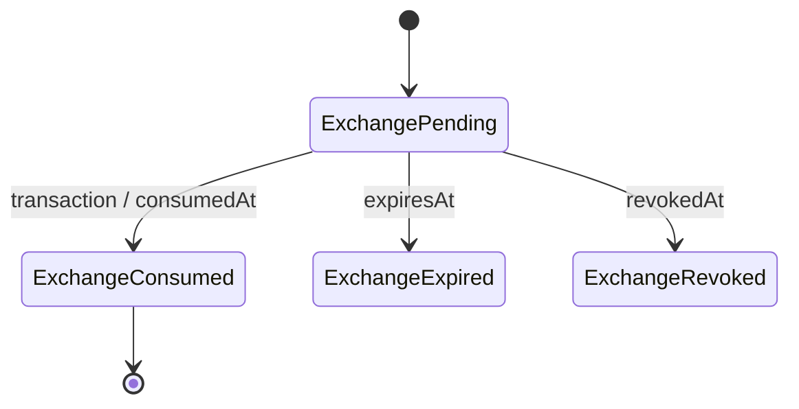
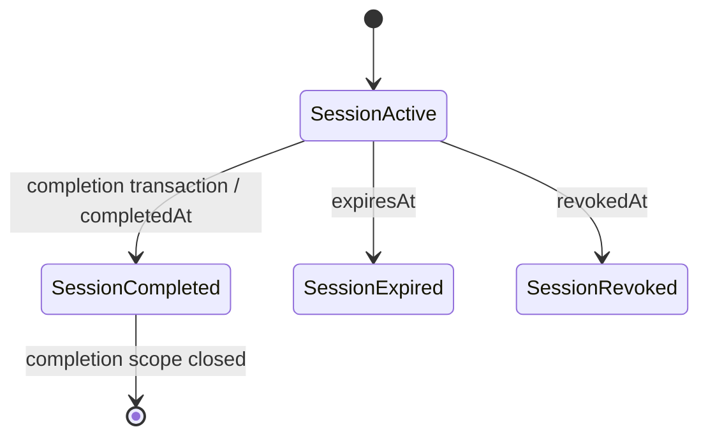
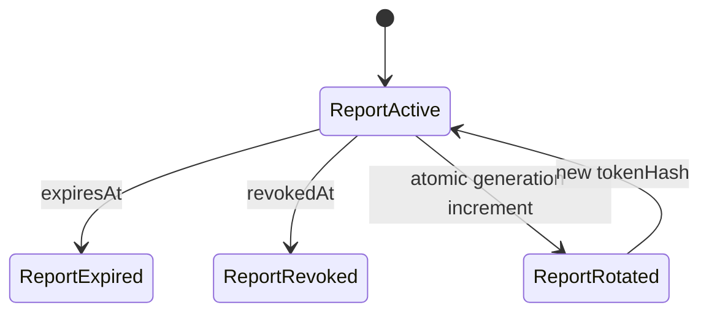

# Discovery Capability Lifecycle V1

**Slice:** AI-02H1E.4.4

**Estado:** implementado; requiere revisión arquitectónica.

**Despliegue:** fuera del alcance.

## Objetivo y límites

`DiscoveryCapabilityV1` separa las credenciales públicas de intercambio, sesión y reporte. El adapter Firestore es la autoridad para consumo, expiración, revocación, generación y completion exactamente una vez. Este slice no modifica App Check, IAM, Firestore Rules, rate limiting, Authority Principal Resolver ni configuración remota.

## Contrato V1

Cada documento contiene `version`, `type`, `subjectId`, `linkId`, `sessionId`, `audience`, `purpose`, `generation`, `tokenHash`, `issuedAt`, `expiresAt`, `consumedAt`, `completedAt`, `revokedAt`, `revocationReason`, `createdAt` y `updatedAt`.

| Tipo | Purpose | Uso autorizado |
|---|---|---|
| `EXCHANGE` | `DISCOVERY_TOKEN_EXCHANGE` | Intercambio single-use por SESSION. |
| `SESSION` | `DISCOVERY_SESSION` | Resolución/conversación activa y una sola completion. |
| `REPORT` | `DISCOVERY_REPORT` | Generación, lectura y descarga del reporte ligado. |

`audience` es `PUBLIC_DISCOVERY`. Los tokens nunca se persisten en claro: el ID y `tokenHash` son SHA-256. El token REPORT se deriva con HMAC-SHA-256 mediante `IDEMPOTENCY_SECRET`; no aparece en documentos ni logs.

## Máquinas de estado

Un estado desconocido, documento incompleto, versión distinta o timestamp inválido falla cerrado.

## Binding y App ID

La autorización valida `tokenHash`, `type`, `purpose`, `audience`, `generation`, `linkId`, `sessionId` y, para REPORT, `subjectId = reportId`. La relación se contrasta con `market_discovery_links` y `discovery_sessions`.

Se evaluó binding a App ID. No se añadió porque el slice no autoriza cambios de App Check ni configuración remota. El App Check existente continúa como gate independiente; no sustituye identidad ni autoridad.

## Expiry, revocación y generation

Expiry se comprueba antes de toda mutación autoritativa y otra vez antes de emitir una URL firmada pública. `revoke()` escribe `revokedAt` y conserva la primera `revocationReason`. `rotateReportCapability()` revoca la generación vigente, crea la siguiente y actualiza el link en una sola transacción. Generation inicial SESSION/REPORT es `1`; cualquier discrepancia falla cerrada.

La TTL REPORT V1 es 24 horas. La URL firmada pública tiene TTL fija de 5 minutos.

## Completion exactamente una vez

`FirestoreDiscoveryCapabilityRepository.completeWithEffect()` ejecuta una transacción (hasta 20 intentos) que:

1. valida SESSION, expiry, revocación, type y purpose;
2. valida link/session/generation;
3. calcula IDs deterministas;
4. detecta replay idéntico o conflicto;
5. resuelve el prospecto dentro de la transacción;
6. crea un dossier y un completion record;
7. marca SESSION con `completedAt`;
8. crea una REPORT capability;
9. actualiza link y datos internos;
10. registra evento y outbox deterministas.

IDs estables:

- `sessionId`/`dossierId`: `dossier_<linkId>_g<generation>`;
- `completionId`: hash del session ID;
- `reportId`: `<sessionId>_EXTERNAL_RADIOGRAFIA_v1.0`;
- `eventId`: hash estable del session ID;
- `notificationKey`: `discovery.completed:<sessionId>`.

Un replay con el mismo request hash devuelve el record existente; otro hash produce `COMPLETION_REQUEST_CONFLICT`. El coalescing local reduce contención dentro de una instancia, pero no decide estado: Firestore sigue siendo autoridad entre procesos.

## Reportes, notificaciones y respuesta pública

La transacción crea `discovery_completion_outbox_v1/<hash(notificationKey)>`. El dispatcher usa Cloud Task ID estable; el worker usa event ID estable y la proyección de inbox es idempotente. `DiscoveryReportGenerationService` conserva reservation record y READY event deterministas.

`requestExecutiveDocument` acepta auth de plataforma mediante el resolver existente o REPORT válida. SESSION no autoriza generación ni descarga. La respuesta pública contiene solo `dossierId`, `reportId`, `reportCapabilityToken` y `trustDecision`; `prospectId`, `resolutionStatus` y matching permanecen server-side.

## Persistencia

- `discovery_capabilities_v1`: EXCHANGE, SESSION y REPORT hash-only.
- `discovery_completions_v1`: reservation/result determinista.
- `discovery_completion_outbox_v1`: fan-out durable.
- Heredadas actualizadas transaccionalmente: `market_discovery_links`, `discovery_sessions`, `platform_leads`, `platform_events`.

## Compatibilidad legacy

La estrategia es V1-only con migración controlada solo en exchange. Un link legacy `pending`, no usado, vigente y con hash coincidente se migra atómicamente; se elimina el hash legacy y se crean EXCHANGE consumida + SESSION V1. Una sesión ya emitida sin documento V1 no tiene fallback y falla cerrada. Datos corruptos o versiones desconocidas quedan rechazados.

Un despliegue futuro invalidaría sesiones activas previas al corte. Requiere ventana operativa, comunicación y decisión de reemisión.

## Errores

`CAPABILITY_NOT_FOUND`, `CAPABILITY_EXPIRED`, `CAPABILITY_REVOKED`, `CAPABILITY_ALREADY_CONSUMED`, `CAPABILITY_TYPE_MISMATCH`, `CAPABILITY_BINDING_MISMATCH`, `CAPABILITY_GENERATION_MISMATCH`, `SESSION_ALREADY_COMPLETED`, `COMPLETION_REQUEST_CONFLICT`, `COMPLETION_INTERNAL_FAILURE`, `REPORT_CAPABILITY_REQUIRED`.

Ninguno revela existencia de prospectos, cuentas o coincidencias CRM.

## Pruebas

`npm.cmd run test:firestore-capability-emulator` fuerza Node v20.20.2, project `demo-*`, ausencia de `GOOGLE_APPLICATION_CREDENTIALS` y Firestore Emulator aislado. Sus 29 casos cubren 2/100 completions simultáneas, retries, conflicto, tipos cruzados, expiry, revocación, rotación, generation, corrupción, legacy fail-closed, efectos únicos y respuesta opaca. P3, P2 y D.9 se revalidan por separado.

## Riesgos, limitaciones y P9

- Una URL firmada ya emitida sigue válida hasta su expiración (máximo 5 minutos). Revocación inmediata exige proxy de descarga u otro mecanismo de storage.
- Rotar el secret HMAC cambia la reproducción del token REPORT; falta un runbook de versionado/rotación.
- El outbox no tiene sweeper general; caller retry reintenta dispatch y el task ID evita duplicados.
- Firestore Rules no cambió; el modelo usa Admin SDK server-side.
- No se añadieron telemetría, consola de revocación, kill switches ni configuración remota.

P9 debe cerrar signed URLs, rotación de secrets, recuperación del outbox, observabilidad sin PII, runbook de revocación, migración de sesiones activas y certificación previa a despliegue.
