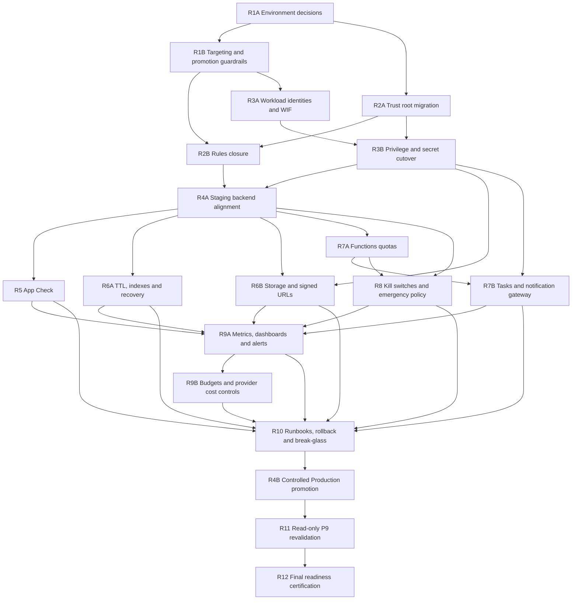

# Production Readiness Execution Sequence v1

## 1. Dependency graph



## 2. Ordered waves

| Wave | Slices | Tipo de cambio | Puede paralelizar | Gate de salida |
|---|---|---|---|---|
| 0 | R1A | Decisiones/documentación | No | IDs, owners, regions, billing y data boundaries aprobados |
| 1 | R1B, R2A | Repo/config design | Sí, tras R1A | Targeting explícito y trust-root migration aprobados |
| 2 | R2B, R3A | Código/Rules e IAM preparation | Parcial | Rules certificadas en Emulator; WIF/SAs diseñadas y creadas por ambiente no productivo |
| 3 | R3B | IAM/secrets cutover | No | Negative permissions y key inventory verdes en Staging |
| 4 | R4A | Staging deployment | No | P1–P8 en Staging, flags OFF, metadata/provenance read-back |
| 5 | R5, R6A, R6B, R7A | Configuración Staging | Sí por servicio | App Check, lifecycle, Storage y runtime limits efectivos |
| 6 | R7B, R8 | Tasks/gateway y containment | Parcial | Queue limitada; policy/rollback Staging certificados |
| 7 | R9A, R9B | Observabilidad/costo | Secuencial | Routing de alertas y budget ownership probados |
| 8 | R10 | Operación/tabletops | No | Trece runbooks aprobados; rollback/break-glass ejercitados |
| 9 | R4B | Production deployment con tráfico apagado | No | Mismo artefacto, IAM/config read-back, all switches OFF |
| 10 | R11 | Read-only | No | P9 v2 sin P0 abiertos |
| 11 | R12 | Certificación independiente | No | Dictamen final y decisión operativa separada |

## 3. Critical path

`R1A → R1B → R2A/R2B → R3A/R3B → R4A → R5/R6/R7/R8 → R9 → R10 → R4B → R11 → R12`

R2A y R3A pueden avanzar en paralelo después de R1A/R1B, pero R4A no comienza hasta cerrar por completo R1–R3. R5, R6A, R6B y R7A pueden ejecutarse en PRs separados sobre Staging. R4B es deliberadamente tardío.

## 4. Promotion sequence

1. Build único desde commit certificado; registrar digest, SBOM y suites.
2. Deploy a Staging con flags OFF, emergency quotas 0, queue PAUSED y límites mínimos.
3. Metadata read-back y negative tests sin side effects.
4. Certificación funcional Staging con datos sintéticos.
5. Aplicar/configurar App Check, TTL/indexes, Storage, quotas, containment y alerts en Staging.
6. Tabletop rollback/break-glass y validar routing.
7. Aprobar Production change set como un paquete inmutable; ningún comando depende de alias `default`.
8. Deploy Production con flags OFF y queue PAUSED.
9. Read-back de commit, identity, secrets por nombre, limits, Rules hash, App Check, TTL/indexes, policy y alerts.
10. Ejecutar R11 sin writes ni invocaciones productivas.
11. R12 evalúa readiness. Enablement gradual queda fuera de este programa de diseño y requiere autorización operativa.

## 5. Expected command discipline

Todo comando futuro:

- incluye `--project=<EXPLICIT_PROJECT_ID>` y región/location cuando aplique;
- se copia al evidence log antes de ejecutarse;
- separa consultas read-only de writes;
- no imprime secretos, tokens, UIDs, emails personales ni payloads;
- falla si el proyecto efectivo no coincide con el manifest aprobado;
- usa CI/WIF para writes, nunca una cuenta personal o key file;
- tiene un comando read-back y un rollback/containment documentado.

Ejemplos read-only esperados:

```text
firebase use --json
gcloud functions list --v2 --regions=us-central1 --project=<PROJECT_ID> --format=json
gcloud firestore fields ttls list --project=<PROJECT_ID>
gcloud firestore indexes composite list --project=<PROJECT_ID>
gcloud tasks queues describe <QUEUE> --location=us-central1 --project=<PROJECT_ID>
gcloud projects get-iam-policy <PROJECT_ID> --format=json
```

Ejemplos write futuros, prohibidos hasta su slice/gate:

```text
firebase deploy --only firestore:rules,storage --project=<STAGING_PROJECT_ID>
firebase deploy --only firestore:indexes --project=<STAGING_PROJECT_ID>
firebase deploy --only functions --project=<STAGING_PROJECT_ID>
gcloud firestore fields ttls update expiresAt --collection-group=discovery_intake_idempotency --enable-ttl --project=<STAGING_PROJECT_ID>
gcloud tasks queues update <QUEUE> --location=us-central1 --project=<STAGING_PROJECT_ID> --max-dispatches-per-second=<APPROVED> --max-concurrent-dispatches=<APPROVED>
```

## 6. Global stop conditions

Detener el slice activo y no avanzar dependientes si ocurre cualquiera:

- ambiente/proyecto/alias ambiguo;
- Preview o Staging comparte datos, secrets, bucket, queue o runtime identity con Production;
- ruleset desplegado no puede leerse antes de un cambio;
- cliente conserva write sobre trust root o server-owned data;
- aparece una key user-managed, secreto, token o credencial rastreada;
- el runtime requiere `Editor`, Owner personal o impersonation no aprobada;
- un deploy no demuestra artefact provenance o cambia el commit esperado;
- una superficie costosa queda habilitada antes de containment y alertas;
- TTL/index entra en error o el cleanup puede borrar evidencia no preservada;
- queue/gateway puede amplificar fan-out o carece de auth/idempotency;
- alert routing, rollback o break-glass falla en Staging;
- P8, D.9, D.8, build, Rules Emulator o negative-permission tests fallan;
- R11 encuentra un P0 o una configuración desconocida bloqueante.

## 7. Rollback hierarchy

1. Containment switches OFF y emergency quotas 0.
2. Pause de queue y bloqueo de fan-out.
3. Traffic/revision rollback al artefacto certificado previo.
4. Rollback de aplicación/clients antes que relajar Rules.
5. Mantener authority/server-owned writes cerrados.
6. Revocar nuevos bindings/secret access sólo después de restaurar el workload anterior seguro.
7. Preservar audit/log evidence y abrir incident review.

TTL y deletes de datos no tienen rollback lógico automático. Su mitigación requiere backups/retention aprobados y validación Staging antes del write Production.

