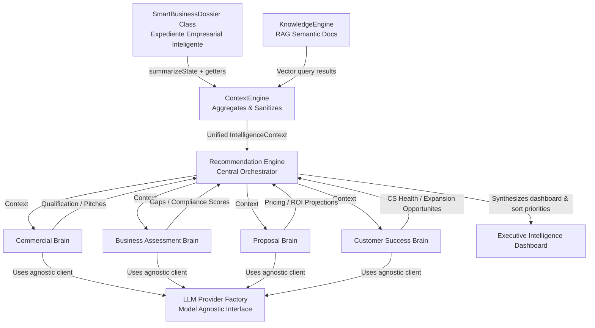

# Aura Intelligence Core

Bienvenido al núcleo de inteligencia artificial y análisis avanzado de **Aura**.

Este módulo contiene la arquitectura fundacional de la IA de Aura. Está diseñado bajo principios de **independencia del modelo (model-agnostic)** y arquitectura de **dominio enriquecido**, permitiendo alternar entre proveedores de modelos lingüísticos (Gemini, ChatGPT, Claude, Azure OpenAI, Llama, Mistral) sin alterar la lógica de negocio.

---

## Arquitectura del Módulo

Toda la inteligencia de Aura gira alrededor del **Expediente Empresarial Inteligente**. El flujo está desacoplado a través del **Context Engine**, asegurando la recopilación limpia de telemetría de negocio y RAG (Generación Aumentada por Recuperación) antes de invocar a los cerebros especializados.



---

## Componentes Clave

### 1. Expediente Empresarial Inteligente (`SmartBusinessDossier`)
Evolucionado de un tipo pasivo a un **modelo de dominio enriquecido** con comportamiento propio. Expone métodos de auto-evaluación:
- `getCompletenessScore()`: Mide la calidad de los datos recopilados del cliente.
- `getHRComplianceGaps()`: Evalúa proactivamente brechas reglamentarias con la LFT (Ley Federal del Trabajo).
- `getFinancialRiskIndicators()`: Identifica incoherencias financieras y alertas críticas de uso.
- `getDigitalMaturityLevel()`: Clasifica la madurez digital operativa de la empresa.

### 2. Context Engine (`ContextEngine`)
Componente responsable de construir el contexto antes de alimentar a los cerebros. Centraliza:
- Extracción del estado actual resumido del Expediente.
- Extracción de hechos derivados de dominio (brechas, advertencias, madurez).
- Recuperación semántica de base de conocimientos (RAG) mediante el `KnowledgeEngine`.
- Entrega de un objeto unificado `IntelligenceContext` inmutable.

### 3. Motores de Inteligencia Especializados (Brains)
Cada cerebro consume el `IntelligenceContext` y utiliza la abstracción de IA para generar análisis especializados:
- **Commercial Brain**: Calificación de oportunidades y redacción de textos comerciales/outreach adaptados a cada canal.
- **Business Assessment Brain**: Identificación profunda de brechas de cumplimiento, cálculo de multas potenciales de la STPS/SAT y sugerencia de remediaciones.
- **Proposal Brain**: Generación dinámica de términos comerciales, cálculo de cotizaciones según volumen, y cálculo proyectado de Retorno de Inversión (ROI).
- **Customer Success Brain**: Evaluación de salud CS, alerta de churn (probabilidad y factores de riesgo) y plan de acción de retención.
- **Recommendation Engine**: El director de orquesta. Consolida todos los análisis anteriores en un listado unificado de acciones priorizadas según severidad y score de impacto financiero.

### 4. Capa Agnóstica de Modelo (`ILLMProvider`)
Define el contrato de interacción con la IA. Los cerebros no saben si llaman a Gemini o a Claude; simplemente consumen una interfaz parametrizada que garantiza tipados estructurados (`generateStructuredOutput<T>`).
- Proveedores disponibles de fábrica: `GeminiProvider`, `ChatGPTProvider`, `ClaudeProvider`, `AzureOpenAIProvider`, `LlamaProvider` (Ollama), `MistralProvider`.

---

## Ejemplo de Integración en Código

```typescript
import SmartBusinessDossier from "./domain/SmartBusinessDossier";
import KnowledgeEngine from "./services/knowledgeEngine";
import ContextEngine from "./services/contextEngine";
import LLMProviderFactory from "./services/llmProviders";
import CommercialBrain from "./services/commercialBrain";
import BusinessAssessmentBrain from "./services/businessAssessmentBrain";
import ProposalBrain from "./services/proposalBrain";
import CustomerSuccessBrain from "./services/customerSuccessBrain";
import RecommendationEngine from "./services/recommendationEngine";

async function runAuraCoreExample() {
  // 1. Inicializar Expediente con telemetría de cliente
  const expediente = new SmartBusinessDossier({
    id: "company_123",
    businessName: "Super Logistics S.A.",
    industry: "Transportes y Logística",
    employeeCount: 85,
    locationsCount: 3,
    hasTimeAndAttendance: false, // Brecha crítica de asistencia (>10 empleados)
    hasElectronicSignature: false,
    payrollSystem: "excel", // Brecha de nómina manual
    healthScoreCS: 65, // Alerta CS roja
  });

  // 2. Inicializar Motores y seleccionar Proveedor de IA de forma agnóstica
  const modelProvider = LLMProviderFactory.getProvider("gemini"); // Puede alternar a 'openai', 'claude', etc.
  const knowledge = new KnowledgeEngine();
  const contextEngine = new ContextEngine(knowledge);

  const commBrain = new CommercialBrain(modelProvider);
  const assessBrain = new BusinessAssessmentBrain(modelProvider);
  const propBrain = new ProposalBrain(modelProvider);
  const csBrain = new CustomerSuccessBrain(modelProvider);

  // 3. Orquestador
  const orchestrator = new RecommendationEngine(
    commBrain,
    assessBrain,
    propBrain,
    csBrain,
    modelProvider
  );

  // 4. Construir contexto del caso & generar Dashboard
  const context = await contextEngine.buildContext(expediente, "Evaluar brechas de cumplimiento y ventas");
  const dashboard = await orchestrator.generateActionDashboard(context);

  console.log("Health Score global de Aura:", dashboard.overallHealthScore);
  console.log("Acciones Prioritarias Sugeridas:");
  dashboard.prioritizedActions.forEach((action) => {
    console.log(`[${action.priorityLevel}] ${action.title} -> ${action.suggestedAction}`);
  });
}
```

---

## Roadmap de Implementación

### Fase 1: Core de Arquitectura (Actual)
- [x] Interfaces de contratación sólidas y tipos estructurados.
- [x] Modelo de dominio enriquecido `SmartBusinessDossier` con lógica interna.
- [x] Context Engine con integración RAG y stubs vectoriales.
- [x] Capa agnóstica de LLM y fábrica de proveedores.

### Fase 2: Implementación de Integraciones Reales (Próximamente)
- [ ] Conectar `GeminiProvider` a la API oficial de Google AI SDK.
- [ ] Conectar `ChatGPTProvider` e integrar biblioteca `openai`.
- [ ] Configurar base de datos vectorial real (ej. Firestore Vector Search o Pinecone) para el `KnowledgeEngine`.
- [ ] Conectar la clase `SmartBusinessDossier` con sincronización en tiempo real hacia colecciones de Firebase.

### Fase 3: Interfaz de Visualización y Generación (Futuro)
- [ ] Dashboard interactivo de Recomendaciones en Aura Control Center.
- [ ] Módulo visual de generación de propuestas en PDF.
- [ ] Agente comercial de chat integrado con las bitácoras y pitches sugeridos.
